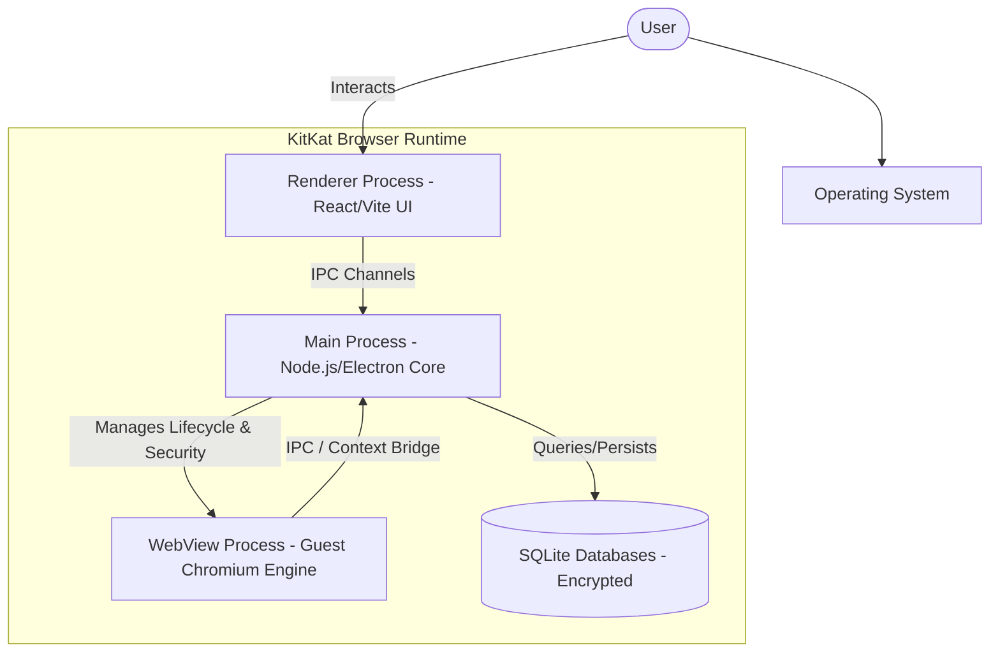

# System Design Overview and Goals - Project Atlas Browser

## 1. Product Vision and Target Audience

Project Atlas Browser is designed to be a next-generation, open-source, privacy-first desktop web browser. It balances the robust compatibility of Chromium and Chrome Extensions with the performance and user-centric features of modern browsers like Brave, Arc, and Vivaldi. It targets power users, developers, and privacy-conscious individuals who require isolated environments, heavy customization, and secure multi-profile workspace management.

### Key Value Differentiators

- **Multi-Profile Security**: True cryptographic profile isolation with PIN, password, or biometric locks, ensuring multiple users can share a single desktop installation securely.
- **Granular Privacy & Ad Blocking**: Out-of-the-box ad blocking, tracker blocking, and fingerprinting mitigation without reliance on third-party extensions.
- **Workspace & Session Desktop**: Workspace environments that function as virtual desktops for browser tabs, allowing seamless state swapping and lazy restoration.
- **Highly Modularity & Plugin Support**: Core components built as decoupled engines (Ad Blocker, Themes, Workspaces, Profiles) with a custom plugin architecture.

---

## 2. Core Architectural Principles

To ensure long-term viability, maintainability, and scalability, the development of Project Atlas Browser follows ten core principles:

1. **Privacy First**: User data is strictly stored locally, encrypted, and minimized. Zero telemetry is collected without explicit opt-in.
2. **Open Source**: Built under the MIT license, encouraging community contributions and complete structural transparency.
3. **Security First**: Process isolation, strict sandboxing, context isolation, and military-grade encryption (AES-256) for stored data.
4. **Fast Performance**: Heavy emphasis on startup speeds (< 2 seconds), optimized memory consumption, and efficient tab sleeping.
5. **Multi-User Support**: Seamless local multi-user support with custom-profile encryption.
6. **Extreme Customization**: Advanced vertical tab layouts, sidebars, modular widgets, and custom theme engines.
7. **Developer Friendly**: Built-in specialized developer tools like JSON and source viewers that remain lightweight.
8. **Community Driven**: Modular architecture encouraging third-party themes, extensions, and plugins.
9. **Cross-Platform**: Parity in core functionality across Windows, macOS, and Linux from a single codebase.
10. **Long-Term Sustainability**: Upstream compliance with the latest Chromium releases through Electron to maintain modern web standard compatibility.

---

## 3. High-Level Architecture Overview

The system relies on Electron, which bundles a Chromium rendering engine and Node.js runtime. We structure Project Atlas by separating operations into a secure **Main Process** (managing SQLite, OS APIs, window lifecycles, and cryptographic keys) and multiple sandboxed **Renderer Processes** (handling the React + TypeScript frontend and individual tab views).

---

## 4. Key Performance Targets

To challenge industry leaders, Project Atlas is engineered around these hard technical benchmarks:

| Metric                  | Target                | Verification Method                                                  |
| :---------------------- | :-------------------- | :------------------------------------------------------------------- |
| **Cold Startup Time**   | < 2.0 Seconds         | Measurement from `main` entry point to first window layout painted.  |
| **RAM footprint**       | < 150MB baseline (UI) | Process-specific memory profiling on fresh startup.                  |
| **Active Tabs Limit**   | 100+ concurrent tabs  | Tab suspension (sleeping tabs) and lazy tab restoration engines.     |
| **Ad Blocker Overhead** | < 5ms per request     | Execution profiling of the Rust-compiled Ad-Block engine wrapper.    |
| **Data Integrity**      | Zero data loss        | Transactional SQLite storage with WAL (Write-Ahead Logging) enabled. |

---

## 5. Technology Stack Decisions

- **Core Runtime**: **Electron (Latest Stable)**. Enables Chromium's rendering power, WebViews, and Native OS integration.
- **UI Layer**: **React + TypeScript + Vite**. Ensures a type-safe, component-driven, high-performance UI shell.
- **Local Persistence**: **SQLite** (using `better-sqlite3` compiled with SQLCipher for AES-256 database-level encryption).
- **State Management**: **Zustand**. A lightweight, hook-based state library for managing global client UI states.
- **Analytics & Diagnostics**: **Sentry** (Opt-in only, configured to scrub PII before transmission).
- **Build System**: **Vite** (Frontend UI) & **electron-builder** (native distributions for macOS, Windows, and Linux).
