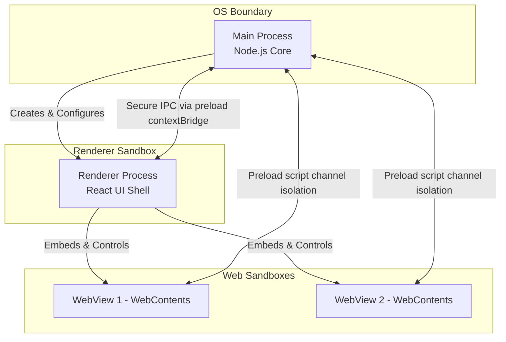
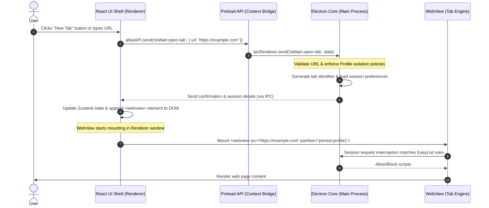

# High-Level Architecture - Process and IPC Design

## 1. Process Model Architecture

Project Atlas utilizes Electron's multi-process model to achieve security, stability, and UI responsiveness. The system is split into three primary process types:

1. **Main Process (Node.js Environment)**: Serves as the system orchestrator. It manages native window creation, handles direct file and database I/O, configures network request interception (Ad blocker), and manages cryptographic operations.
2. **Renderer Process (Web Environment)**: Displays the browser shell UI (address bar, tab strips, sidebar, settings panels). Built using React, Zustand, and TypeScript, it is sandboxed and runs without direct access to Node.js APIs.
3. **WebView Processes (Chromium WebContents)**: Individual isolated sandboxed instances that render untrusted third-party web pages. They are structurally isolated from the Renderer UI process to prevent malicious web scripts from accessing the application control interfaces.



---

## 2. Main Process Responsibilities

The Main process acts as the supervisor with full operating system access. Its responsibilities are scoped strictly to security-critical and OS-level operations:

- **Lifecycle Management**: Creation, resizing, positioning, and destruction of application windows.
- **Storage and Persistence**: Interacting with SQLite databases (saving history, bookmarks, notes, and profiles).
- **Cryptographic Engine**: Deriving encryption keys via Argon2id and executing AES-256 decryption/encryption for the password manager and database files.
- **Network & Session Isolation**: Constructing Electron sessions for different profiles and intercepting web requests for the ad-blocking engine.
- **System Menus & Shortcuts**: Binding keyboard shortcuts globally and registering native menus.

---

## 3. Renderer Process & Preload Integration

The Renderer process manages the visual interface. It executes in a highly restricted sandbox with:

- `nodeIntegration` set to `false`.
- `contextIsolation` set to `true`.
- `sandbox` enabled.

To communicate with the Main process safely, the Renderer utilizes a **Preload Script** (`preload.js`). The preload script runs in an intermediate context, utilizing `contextBridge.exposeInMainWorld` to expose a curated, type-safe API to the React application.

### Secure Context Bridge Definition

```typescript
// src/preload/index.ts
import { contextBridge, ipcRenderer } from 'electron'

contextBridge.exposeInMainWorld('atlasAPI', {
  send: (channel: string, data: any) => {
    // Whitelist outgoing channels
    const validChannels = ['toMain:open-tab', 'toMain:update-settings', 'toMain:switch-profile']
    if (validChannels.includes(channel)) {
      ipcRenderer.send(channel, data)
    }
  },
  invoke: async (channel: string, data: any): Promise<any> => {
    // Whitelist bi-directional channels
    const validChannels = [
      'invokeMain:get-history',
      'invokeMain:lock-profile',
      'invokeMain:decrypt-vault'
    ]
    if (validChannels.includes(channel)) {
      return await ipcRenderer.invoke(channel, data)
    }
  },
  receive: (channel: string, func: (...args: any[]) => void) => {
    // Whitelist incoming channels
    const validChannels = [
      'fromMain:tab-loaded',
      'fromMain:ad-blocked-count',
      'fromMain:profile-locked'
    ]
    if (validChannels.includes(channel)) {
      const subscription = (_event: any, ...args: any[]) => func(...args)
      ipcRenderer.on(channel, subscription)
      return () => {
        ipcRenderer.removeListener(channel, subscription)
      }
    }
  }
})
```

---

## 4. IPC Flow: Opening a New Tab

This sequence diagram illustrates the secure data flow when a user clicks the "New Tab" button in the React UI, triggering IPC messaging and WebView lifecycle orchestration.


