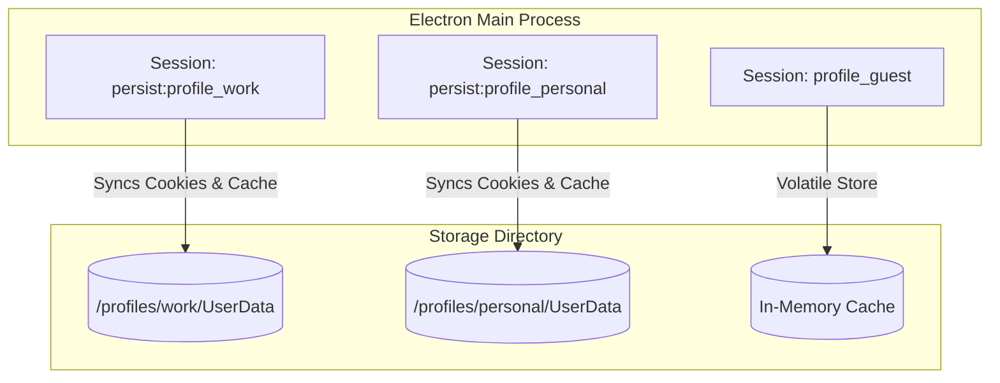
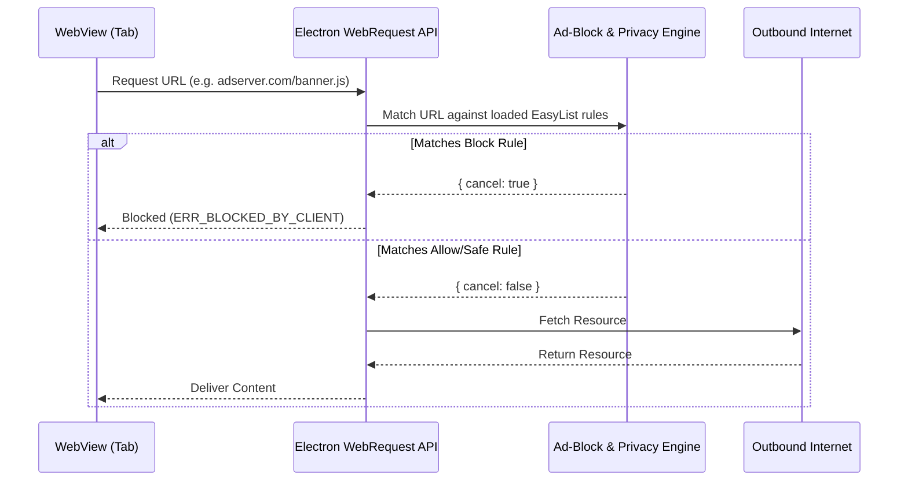

# Chromium Integration Strategy - WebViews, Sessions, and Request Interception

## 1. Electron WebView Integration

To display untrusted web content, Project Atlas relies on Electron `<webview>` tags rather than BrowserViews or native child windows. This choice provides the necessary flexibility for complex UI designs (like sidebars, vertical tab layouts, and custom overlay widgets) which are rendered in the React layer.

### Security Configurations for WebViews

Every webview mounted by the UI shell must be rigidly sandboxed. The following attributes are strictly configured at runtime:

```html
<webview
  src="https://example.com"
  partition="persist:profile_work"
  preload="file:///path/to/webview-preload.js"
  webpreferences="contextIsolation=yes, nodeIntegration=no, sandbox=yes, enableWebSQL=no"
  style="display: flex; width: 100%; height: 100%;"
></webview>
```

- **`partition="persist:<profile_id>"`**: Routes cookies, localStorage, cache, and indexDB requests to the specific profile's storage folders. Temporary profiles use `partition="profile_guest"`.
- **`preload="..."`**: Executes a isolated webview-preload script to inject browser-specific APIs (like reading mode parsers or password autofill scripts) without exposing any Main process APIs to the page.
- **`webpreferences` flags**: Disables Node.js access and enforces sandboxing at the Chromium rendering layer.

---

## 2. Session Partition Architecture

Chromium manages profiles using partitions. Electron exposes this through `session.fromPartition(partitionName)`. Project Atlas creates separate, isolated storage environments on the disk by matching partitions to user profiles.



### Implementing Session Partitions

```typescript
import { session, app } from 'electron'
import path from 'path'

export function configureProfileSession(profileId: string, isGuest = false) {
  const partitionName = isGuest ? `profile_${profileId}` : `persist:profile_${profileId}`
  const sess = session.fromPartition(partitionName)

  if (!isGuest) {
    // Configure separate directories on disk
    const profilePath = path.join(app.getPath('userData'), 'profiles', profileId)
    sess.setStoragePath(profilePath)
  } else {
    // Guest sessions have no storage path (strictly in-memory)
    sess.setStoragePath('')
  }

  // General network cache policies
  sess.setPermissionRequestHandler((webContents, permission, callback) => {
    const allowedPermissions = ['notifications', 'fullscreen']
    callback(allowedPermissions.includes(permission))
  })

  return sess
}
```

---

## 3. Network Request Interception Strategy

All outbound HTTP/HTTPS requests from WebContents are routed through the custom Ad-Blocking and Privacy filters. This is implemented via the Electron `webRequest` API registered on each profile's session.



### Request Interception Handler Setup

```typescript
import { Session } from 'electron'

export function registerRequestFilters(sessionInstance: Session, adBlockerEngine: any) {
  sessionInstance.webRequest.onBeforeRequest(
    { urls: ['http://*/*', 'https://*/*'] },
    (details, callback) => {
      // Exclude application internal UI URLs
      if (details.url.startsWith('atlas://') || details.url.startsWith('file://')) {
        return callback({ cancel: false })
      }

      // Check URL matching EasyList or EasyPrivacy lists
      const isBlocked = adBlockerEngine.checkUrl(details.url, details.method, details.referrer)

      if (isBlocked) {
        // Trigger IPC event to update UI Block Counter
        const win = details.webContentsId ? details.webContentsId : null
        // Increment counter in global main state
        return callback({ cancel: true })
      }

      // Allow clean requests
      callback({ cancel: false })
    }
  )
}
```
