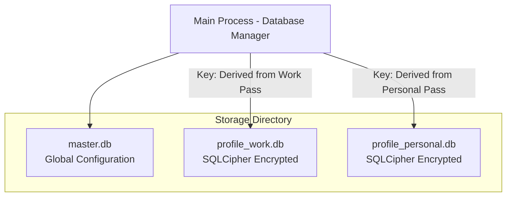

# Database Schema and Encryption Design

## 1. Multi-Database Architecture

To ensure physical isolation and strong cryptographic security, Project Atlas uses a two-tier database architecture based on SQLite and SQLCipher:

1. **Global Master Database (`master.db`)**: Unencrypted (or encrypted with an application-specific system key). It stores system-wide preferences, the list of existing profiles, and basic metadata (such as profile avatar, color scheme, and lock status).
2. **Encrypted Profile Databases (`profile_<id>.db`)**: Each profile maintains its own completely isolated SQLite database file. When a profile is locked, its database is encrypted using SQLCipher (AES-256-CBC) using a key derived from the user's password or PIN. Without the user entering their password, this file is cryptographically unreadable.



---

## 2. Global Master Database Schema (`master.db`)

This database contains tables to track users, system layouts, and initial boot configurations.

```sql
-- Profiles Table
CREATE TABLE profiles (
    id TEXT PRIMARY KEY,               -- UUID string
    name TEXT NOT NULL,                -- Profile name (e.g. "Work")
    avatar_url TEXT,                   -- Path to profile avatar icon
    lock_type TEXT DEFAULT 'none',     -- 'none', 'pin', 'password', 'biometric'
    key_salt TEXT,                     -- Hex string salt used for Argon2id key derivation
    key_verification_hash TEXT,        -- Hash of derived key to verify correct entry without decrypting DB
    created_at INTEGER NOT NULL,       -- Unix timestamp
    last_active INTEGER NOT NULL       -- Unix timestamp
);

-- Global Settings Table
CREATE TABLE global_settings (
    key TEXT PRIMARY KEY,
    value TEXT NOT NULL
);
```

---

## 3. Profile Database Schema (`profile_<id>.db`)

Each profile-specific database is encrypted in its entirety. It stores all local records for the browsing session.

### Browsing History and Bookmarks

```sql
-- History Visited Links Table
CREATE TABLE history (
    id INTEGER PRIMARY KEY AUTOINCREMENT,
    url TEXT NOT NULL,
    title TEXT,
    visit_count INTEGER DEFAULT 1,
    last_visit_time INTEGER NOT NULL,  -- Unix timestamp
    typed_count INTEGER DEFAULT 0      -- Tracks if URL was typed manually
);

-- Index for fast address bar autocompletion
CREATE INDEX idx_history_url ON history(url);
CREATE INDEX idx_history_last_visit ON history(last_visit_time DESC);

-- Bookmarks Table
CREATE TABLE bookmarks (
    id TEXT PRIMARY KEY,               -- UUID
    parent_id TEXT,                    -- Reference to parent bookmark folder (NULL for root)
    title TEXT NOT NULL,
    url TEXT,                          -- NULL if it is a folder container
    is_folder INTEGER DEFAULT 0,       -- Boolean (0 = bookmark, 1 = folder)
    position INTEGER NOT NULL,         -- Ordering index within parent folder
    created_at INTEGER NOT NULL
);
CREATE INDEX idx_bookmarks_parent ON bookmarks(parent_id);
```

### Notes, Workspaces, and Settings

```sql
-- Built-in Markdown Notes
CREATE TABLE notes (
    id TEXT PRIMARY KEY,
    parent_folder_id TEXT,             -- Support recursive note folders
    title TEXT NOT NULL,
    content TEXT,                      -- Markdown text
    is_folder INTEGER DEFAULT 0,       -- 1 if folder container
    created_at INTEGER NOT NULL,
    updated_at INTEGER NOT NULL
);

-- Workspaces Table
CREATE TABLE workspaces (
    id TEXT PRIMARY KEY,
    name TEXT NOT NULL,
    icon TEXT,                         -- Workspace visual identifier
    position INTEGER NOT NULL          -- Workspace tab-bar ordering
);

-- Workspace Tabs (State restoration mapping)
CREATE TABLE workspace_tabs (
    id TEXT PRIMARY KEY,
    workspace_id TEXT NOT NULL,
    url TEXT NOT NULL,
    title TEXT,
    pinned INTEGER DEFAULT 0,
    tab_order INTEGER NOT NULL,
    is_sleeping INTEGER DEFAULT 0,
    scroll_position_x INTEGER DEFAULT 0,
    scroll_position_y INTEGER DEFAULT 0,
    FOREIGN KEY(workspace_id) REFERENCES workspaces(id) ON DELETE CASCADE
);

-- Profile Specific Settings
CREATE TABLE profile_settings (
    key TEXT PRIMARY KEY,
    value TEXT NOT NULL
);
```

### Encrypted Passwords Vault

This table is securely stored inside the profile database, gaining immediate hardware-level protection from SQLCipher encryption.

```sql
-- Password Credentials Vault
CREATE TABLE password_vault (
    id TEXT PRIMARY KEY,
    url TEXT NOT NULL,                 -- Target website URL base
    username TEXT NOT NULL,
    password_ciphertext TEXT NOT NULL, -- Encrypted credential string
    created_at INTEGER NOT NULL,
    updated_at INTEGER NOT NULL
);
CREATE INDEX idx_vault_url ON password_vault(url);
```
