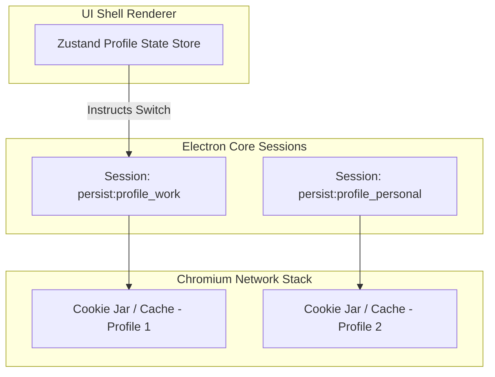
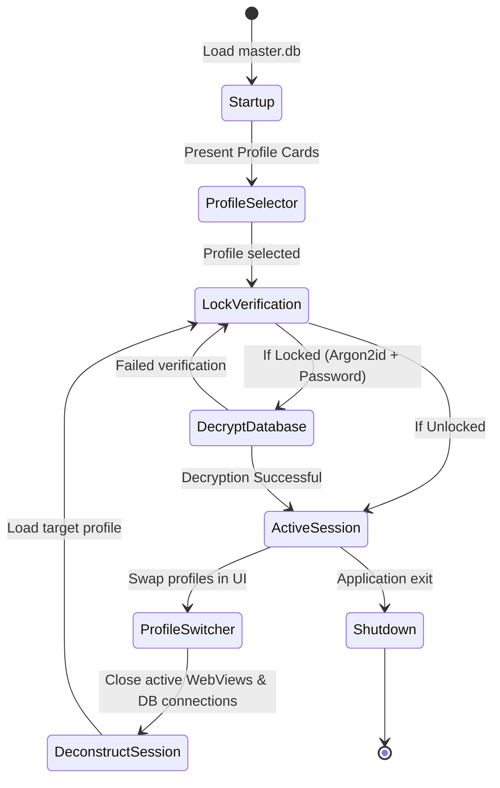

# Multi-Profile Architecture and Data Isolation

## 1. Directory Structure on Disk

To guarantee absolute data isolation, Project Atlas separates user profiles at the operating system file system level. All profile-specific assets are housed within discrete folders under the user's primary application data directory:

```text
/Users/<User>/Library/Application Support/kitkatbrowser/   (macOS example)
├── master.db                     <-- Global master database
├── global_settings.json
└── profiles/
    ├── work/                     <-- Profile folder (UUID/ID)
    │   ├── profile_work.db       <-- SQLCipher encrypted db
    │   ├── Local Storage/        <-- Chromium LocalStorage
    │   ├── IndexedDB/            <-- Chromium IndexedDB database
    │   ├── Cache/                <-- Chromium HTTP cache
    │   ├── Network/              <-- Cookies and Network state
    │   └── Extensions/           <-- Extracted Extensions directory
    └── personal/
        ├── profile_personal.db
        ├── Local Storage/
        └── Network/
```

---

## 2. Profile Isolation Mechanics

Isolation is enforced across three primary layers: **Network & Cookies**, **Client Storage**, and **UI State Manager (Zustand)**.



### Key Isolation Enforcements:

1. **Cookie Separation**: Each profile operates on its own cookiestore, ensuring that logging in to a web app on "Profile 1" does not authenticate or leak session states to "Profile 2".
2. **Distinct Cache Directories**: Prevents performance cross-contamination or timing-based cache attacks.
3. **Extension Sandboxing**: Extensions are loaded dynamically on a per-profile session basis using:
   `session.fromPartition('persist:profile_work').loadExtension(path)`.

---

## 3. Profile Lifecycle Management

When a user launches Project Atlas, they are greeted by a profile selection screen. The lifecycle behaves as follows:



### Safe Profile Switching Implementation

```typescript
import { app, BrowserWindow, session } from 'electron'
import { configureProfileSession } from './session-manager'
import { closeDatabaseConnection, openDatabaseConnection } from './db'

let activeProfileId: string | null = null

export async function switchProfile(targetProfileId: string, password?: string) {
  // 1. Teardown active session views
  if (activeProfileId) {
    await closeDatabaseConnection(activeProfileId)
  }

  // 2. Open new profile database connection
  await openDatabaseConnection(targetProfileId, password)

  // 3. Initialize separate session
  const targetSession = configureProfileSession(targetProfileId)

  // 4. Update window session assignment
  activeProfileId = targetProfileId

  // Send update notification to Renderer
  const wins = BrowserWindow.getAllWindows()
  for (const win of wins) {
    win.webContents.send('fromMain:profile-switched', {
      profileId: targetProfileId
    })
  }
}
```

---

## 4. Ephemeral Guest Profile Execution

Guest profiles are designed for quick, anonymous browsing where all traces of the session must be deleted immediately upon closing.

- **Partition Protocol**: Built using an in-memory session partition: `session.fromPartition('profile_guest_temp')`.
- **Zero Disk Persistence**: All index databases, cookies, security certificates, and cache files are stored solely in volatile RAM.
- **Auto-Teardown**: When the Guest profile window closes, the partition is garbage collected by Chromium.
- **Database Wiping**: No SQLite databases are created on the disk; temporary session settings are loaded into an in-memory SQLite schema (`:memory:`) and completely purged when the Node runtime terminates.
