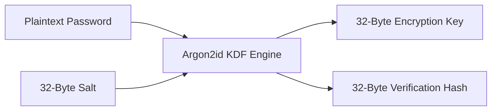
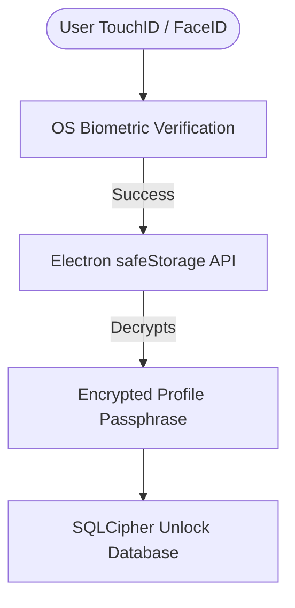

# Password Lock and Cryptographic Architecture

## 1. Key Derivation Framework (Argon2id)

When a user configures a Password or PIN lock on a profile, the actual encryption key used for the SQLite database is derived using **Argon2id** (the industry-standard memory-hard key derivation function). Plaintext passwords or PINs are never written to disk.

### Argon2id KDF Standard Parameters

To resist GPU-accelerated brute-force attacks, the key derivation parameters are defined as follows:

| Parameter                  | Value               | Rationale                                                          |
| :------------------------- | :------------------ | :----------------------------------------------------------------- |
| **Time Cost (Iterations)** | 3                   | Balances resistance to side-channel attacks and UI responsiveness. |
| **Memory Cost**            | 64 MB (65,536 KB)   | Prevents high-speed memory-bound cracking rigs.                    |
| **Parallelism (Threads)**  | 4                   | Optimizes utilization of modern multi-core CPUs.                   |
| **Salt Length**            | 32 Bytes            | Cryptographically secure random bytes generated per profile.       |
| **Derived Key Length**     | 32 Bytes (256 bits) | Matches SQLCipher's native AES-256 key requirement.                |



---

## 2. SQLCipher Database Security

Once the 256-bit encryption key is derived, it is fed directly into SQLCipher to unlock the profile-specific SQLite file. SQLCipher provides transparent page-level encryption:

- **Algorithm**: AES-256-CBC (Cipher Block Chaining).
- **Authentication**: HMAC-SHA512.
- **Initialization Vector (IV)**: Generated uniquely per database page using a cryptographically secure random number generator (CSPRNG).
- **Key Derivation at Database Level**: We enforce raw database key injection so SQLCipher does not perform its own default PBKDF2 derivation, yielding instant database unlocking:

```javascript
const db = require('better-sqlite3')('profile_work.db')
// Inject key directly into SQLite connection before executing any queries
db.pragma(`key = "x'${derivedKeyHex}'"`)
```

---

## 3. Password Verification Protocol

To verify the user's password during profile authentication without decrypting the entire database, we implement a secure verification hash.

1. **Generation**:
   $$VerificationHash = Argon2id(DerivedKey, VerifierSalt)$$
2. **Storage**: The `profiles` table in `master.db` stores:
   - `key_salt` (used to derive the primary key).
   - `key_verification_hash` (the verification signature).
3. **Validation Flow**:
   - User inputs password.
   - System derives temporary key using the password and `key_salt`.
   - System hashes the derived key with the `VerifierSalt` and compares it to `key_verification_hash`.
   - If they match, the derived key is confirmed correct and SQLCipher is initialized.

---

## 4. Hardware Biometrics & Keychain Integration

For macOS (Touch ID), Windows (Windows Hello), and Linux (Secret Service), users can bypass manual passwords using native OS cryptographic vaults.



### Encryption using Electron's `safeStorage` API

When the user enables "Remember Password via Biometrics", the browser executes the following protocol:

1. The derived profile key is encrypted using Electron's native `safeStorage.encryptString()` API.
2. Under the hood, `safeStorage` binds the encryption key to:
   - **macOS**: Apple Keychain Services API.
   - **Windows**: Data Protection API (DPAPI).
   - **Linux**: Libsecret library.
3. The resulting ciphertext is stored in the `global_settings` table of `master.db`.
4. Upon next boot, the browser requests biometric authorization. On success, the OS decrypts the credential, giving the program the raw key to mount the profile database.
5. If biometric verification fails, the browser falls back to requesting the user's manual Master Password.
