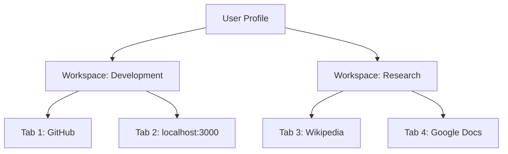
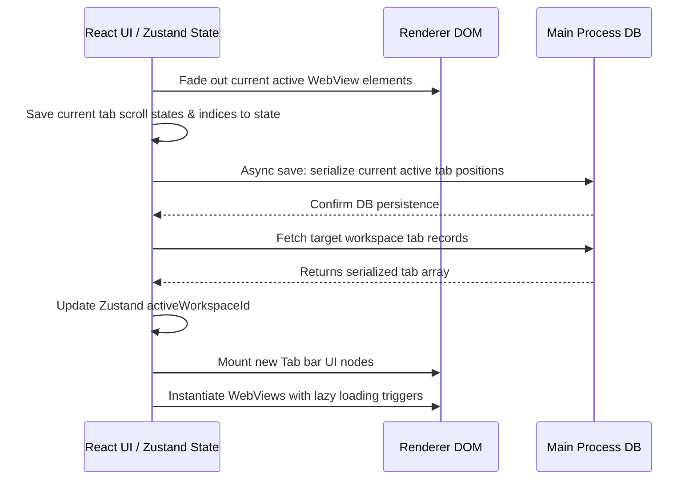
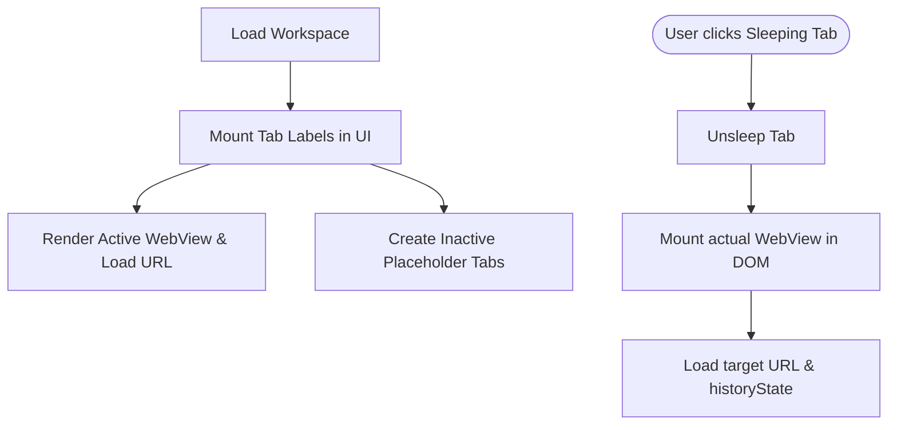

# Workspace Architecture and Tab State Restoration

## 1. Workspace Isolation Model

Workspaces function as "virtual desktops" inside a single user profile. They allow users to partition their browser tabs into distinct contexts (e.g., "Development", "Personal", "Research") without spawning separate browser instances or leaking tabs between work contexts.



### Workspace Properties

A workspace is defined by:

- **Unique ID**: UUID string.
- **Metadata**: Name, custom icon, color badge, and display order.
- **Tabs List**: Ordered array of serialized tab state objects.
- **Active Tab Index**: The tab currently focused when this workspace is loaded.

---

## 2. Tab State Serialization

To restore a workspace accurately, the browser must save the comprehensive state of each tab. This data is serialized into the SQLite profile database `workspace_tabs` table.

### Serialized Tab Schema

```json
{
  "id": "tab-uuid-8899",
  "workspaceId": "ws-uuid-1122",
  "url": "https://github.com/profile/repo",
  "title": "GitHub Repository",
  "pinned": false,
  "tabOrder": 1,
  "zoomLevel": 1.0,
  "isSleeping": false,
  "scrollPosition": {
    "x": 0,
    "y": 450
  },
  "historyState": {
    "currentIndex": 2,
    "entries": [
      "https://github.com/",
      "https://github.com/profile",
      "https://github.com/profile/repo"
    ]
  }
}
```

---

## 3. Workspace Switching Sequence

When a user switches workspaces, the UI must rapidly detach existing WebViews and load the target workspace's tab layout.



---

## 4. Lazy Restoring Strategy

Loading 100+ concurrent WebViews during a workspace switch or app startup would immediately throttle the CPU and consume gigabytes of RAM. Project Atlas enforces a **Lazy Tab Restoration** model:



### Lazy Tab Renderer Logic (React Component)

```typescript
import React, { useState } from 'react';

interface TabProps {
  id: string;
  url: string;
  isActive: boolean;
  isSleeping: boolean;
}

export const TabWebViewWrapper: React.FC<TabProps> = ({ id, url, isActive, isSleeping }) => {
  const [hasBeenActivated, setHasBeenActivated] = useState(isActive);

  // If tab becomes active, force mounting
  if (isActive && !hasBeenActivated) {
    setHasBeenActivated(true);
  }

  // If the tab is sleeping or has never been clicked, only render an empty div placeholder
  if (!hasBeenActivated) {
    return (
      <div className="tab-placeholder" style={{ display: 'none' }}>
        <p>Tab is sleeping...</p>
      </div>
    );
  }

  // Active or previously active (cached) tab WebView
  return (
    <webview
      id={`webview-${id}`}
      src={url}
      style={{ display: isActive ? 'flex' : 'none', width: '100%', height: '100%' }}
      partition="persist:profile_work"
    />
  );
};
```
