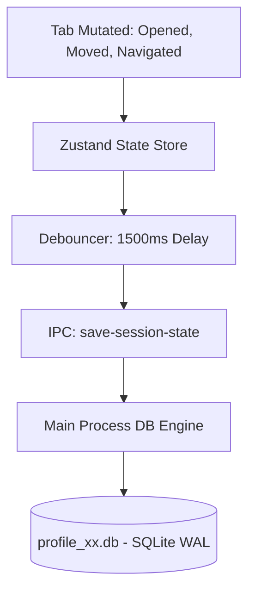
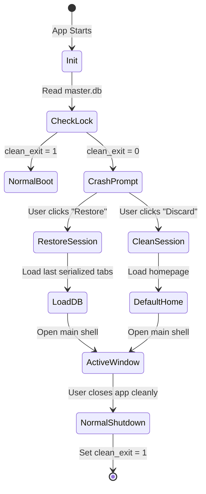
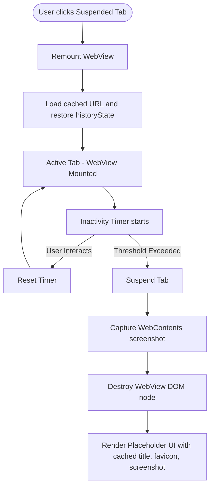

# Session Management and Crash Recovery Architecture

## 1. Continuous Auto-Saver Architecture

To prevent data loss from accidental app termination or system crashes, Project Atlas implements a non-blocking, asynchronous session auto-saver. The browser shell continuously monitors mutation events in the global Zustand state and schedules delta updates to the local SQLite database.



- **Debouncing Logic**: State changes (such as dragging tabs or navigating pages) trigger a 1500ms debounce timer. This aggregates multiple actions (like rapid typing in the address bar) into a single write transaction.
- **Write-Ahead Logging (WAL)**: SQLite is initialized with `PRAGMA journal_mode=WAL` to ensure that writing session snapshots does not lock the database, preventing UI stuttering.

---

## 2. Crash Detection and Recovery System

When the browser starts, it must determine if the previous session exited gracefully.



### Crash Detection Protocol:

1. At boot, the Main process reads the profile metadata. If `clean_exit` is set to `0` (or `false`), the browser knows a crash occurred.
2. At boot, the Main process immediately sets `clean_exit` to `0` for the current active profile.
3. During a controlled app shutdown, the Main process executes a cleanup hook and updates the profile record, setting `clean_exit` back to `1`.
4. If a crash occurs, the exit hook never triggers, leaving `clean_exit = 0` for the next boot cycle.

---

## 3. Tab Suspension (Sleeping Tabs) Engine

To maintain a low RAM footprint (matching or beating Google Chrome), Project Atlas automatically suspends tabs that have been inactive for a user-defined threshold (e.g., 30 minutes).

### Tab Inactivity Lifecycle



### Programmatic WebView Suspension

```typescript
class TabSuspender {
  private inactivityTimers: Map<string, NodeJS.Timeout> = new Map()
  private thresholdMs: number = 30 * 60 * 1000 // 30 minutes

  public registerTabActivity(tabId: string) {
    this.clearTimer(tabId)

    const timer = setTimeout(() => {
      this.suspendTab(tabId)
    }, this.thresholdMs)

    this.inactivityTimers.set(tabId, timer)
  }

  public clearTimer(tabId: string) {
    if (this.inactivityTimers.has(tabId)) {
      clearTimeout(this.inactivityTimers.get(tabId)!)
      this.inactivityTimers.delete(tabId)
    }
  }

  private async suspendTab(tabId: string) {
    // Send event to Renderer UI to tear down the WebView for this tab ID
    // 1. Capture thumbnail via webcontents capturePage
    // 2. Set tab state 'isSleeping = true' in Zustand
    // 3. Destructure DOM webview element
    ipcRenderer.send('toRenderer:suspend-tab-ui', { tabId })
  }
}
```
