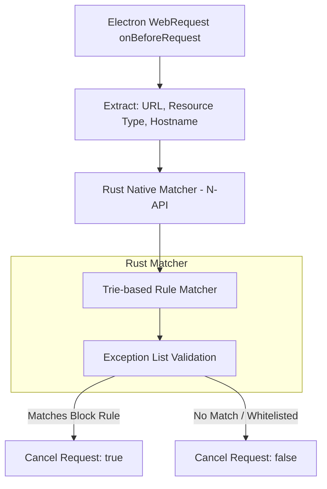
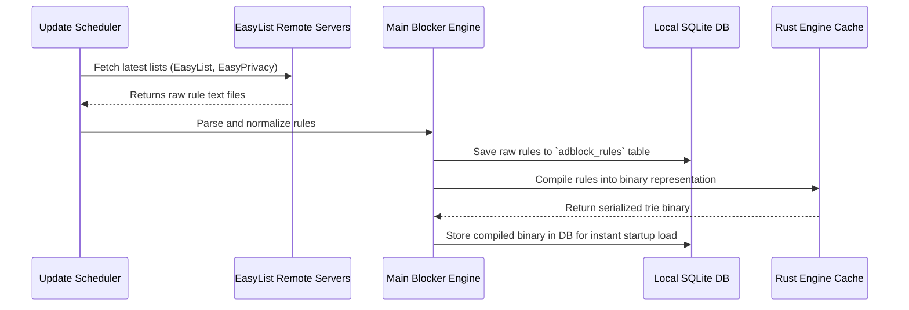

# Built-in Ad Blocker Architecture

## 1. High-Performance Filtering Pipeline

Project Atlas features a native, zero-extension ad and tracker blocker built directly into the request lifecycle. To achieve a request-matching latency of `< 5ms`, the engine compilation and lookup matching are executed in a **Rust-based N-API native module** (`@atlas/adblock-core`) loaded directly by the Electron Main Process.



---

## 2. Rule Compilation and Storage

The ad blocker supports standard blocklist formats used by EasyList and EasyPrivacy.



### Compile Engine Data Structure

The Rust module compiles raw declarative rules into a serialized **Trie (Prefix Tree)** search structure. This structure groups patterns by their domain and path prefixes, allowing $O(log\ N)$ search performance instead of linear scanning ($O(N)$).

---

## 3. Web Request Interceptor Integration

When a session is configured, the Main Process hooks into the `onBeforeRequest` and `onHeadersReceived` event listeners:

```typescript
import { session } from 'electron'
import { NativeAdBlocker } from '@atlas/adblock-core'

export function initializeAdBlocker(
  profileSession: Electron.Session,
  blockerInstance: NativeAdBlocker
) {
  profileSession.webRequest.onBeforeRequest(
    { urls: ['http://*/*', 'https://*/*'] },
    (details, callback) => {
      // 1. Skip core assets
      if (details.url.startsWith('chrome-extension://') || details.url.startsWith('atlas://')) {
        return callback({ cancel: false })
      }

      // 2. Query the Rust trie matcher
      const matchResult = blockerInstance.match({
        url: details.url,
        sourceUrl: details.referrer || '',
        resourceType: details.resourceType // 'script', 'image', 'stylesheet', etc.
      })

      if (matchResult.isMatch && !matchResult.isWhitelisted) {
        // Broadcast block count increment to specific window
        if (details.webContentsId) {
          notifyBlockCounter(details.webContentsId)
        }
        return callback({ cancel: true }) // BLOCK URL
      }

      callback({ cancel: false }) // ALLOW URL
    }
  )
}
```

---

## 4. Element Hiding Rules (CSS Injection)

Many ad servers hide behind first-party domains where blocklisting the URL would break functional page features. To solve this, Project Atlas injects custom User Stylesheets into the WebView DOM.

1. **Compilation**: The Ad Blocker engine extracts declarative cosmetic rules from EasyList (e.g., `##.ad-banner`, `youtube.com##.ytp-ad-overlay-container`).
2. **Parsing**: Rules are grouped by target domains.
3. **Injection**: When a WebView navigates to a domain, a preload script or the Electron `insertCSS` API is triggered to inject a tailored stylesheet that forces element hiding.

### CSS Injection Script

```typescript
// Executed in WebView preload script
window.addEventListener('DOMContentLoaded', () => {
  const currentDomain = window.location.hostname

  // Request active CSS selector rules from Main Process via IPC
  ipcRenderer.invoke('get-cosmetic-selectors', currentDomain).then((selectors: string[]) => {
    if (selectors && selectors.length > 0) {
      const styleNode = document.createElement('style')
      styleNode.type = 'text/css'
      // Create rules: .ad-banner, .ytp-ad-overlay-container { display: none !important; }
      styleNode.innerHTML = `${selectors.join(', ')} { display: none !important; }`
      document.head.appendChild(styleNode)
    }
  })
})
```

---

## 5. Site Rules and Whitelists

Users can control the Ad Blocker through the URL bar shield icon.

- **Shields Up (Default)**: Full tracking and ad blocking active.
- **Shields Down**: Bypasses the WebRequest filtering rule match checks and disables stylesheet injections for the current domain.
- **Custom Rules**: Stored in the profile database, allowing custom exclusions (e.g., `@@||sponsorpay.com^$domain=targetsite.com`).
