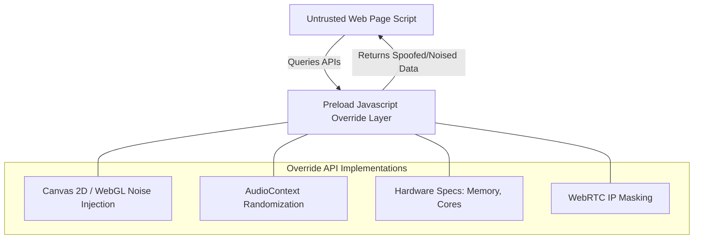
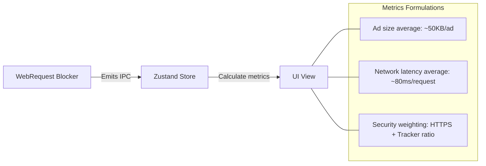

# Privacy Architecture and Fingerprint Mitigation

## 1. Browser Fingerprint Mitigations

Browser fingerprinting identifies a machine by querying browser configurations, hardware profiles, and graphics rendering behavior. Project Atlas mitigates fingerprinting by injecting spoofing layers directly into the global Javascript execution scope of every WebView before any page scripts can execute.



### Overriding APIs via Preload Scripts

We override read-only properties on the `navigator` object and add minor noise elements to Canvas/Audio buffers:

```javascript
// webview-preload.js
;(function () {
  // 1. Spoof Hardware Specifications to standard profiles
  Object.defineProperty(navigator, 'hardwareConcurrency', { get: () => 4 })
  Object.defineProperty(navigator, 'deviceMemory', { get: () => 8 })

  // 2. Prevent Screen Resolution Harvesting
  Object.defineProperty(Screen.prototype, 'width', { get: () => 1920 })
  Object.defineProperty(Screen.prototype, 'height', { get: () => 1080 })
  Object.defineProperty(Screen.prototype, 'availWidth', { get: () => 1920 })
  Object.defineProperty(Screen.prototype, 'availHeight', { get: () => 1080 })

  // 3. Canvas Fingerprinting Mitigation (Add subtle pixel noise to readbacks)
  const originalGetImageData = CanvasRenderingContext2D.prototype.getImageData
  CanvasRenderingContext2D.prototype.getImageData = function (x, y, w, h) {
    const imageData = originalGetImageData.apply(this, arguments)
    const data = imageData.data
    // Inject imperceptible noise into the least significant bit of color channels
    for (let i = 0; i < data.length; i += 4) {
      data[i] = data[i] ^ (Math.random() > 0.5 ? 1 : 0) // Red
      data[i + 1] = data[i + 1] ^ (Math.random() > 0.5 ? 1 : 0) // Green
      data[i + 2] = data[i + 2] ^ (Math.random() > 0.5 ? 1 : 0) // Blue
    }
    return imageData
  }
})()
```

---

## 2. WebRTC IP Leakage Prevention

WebRTC requests can reveal a user's real local/private LAN IP address even when behind a VPN. Project Atlas blocks this leakage by forcing WebRTC traffic routing policies at the session level:

```typescript
import { Session } from 'electron'

export function configureWebRTCPolicies(sessionInstance: Session) {
  // Disable local IP address sharing via WebRTC candidates
  sessionInstance.setWebRTCIPHandlingPolicy('disable_non_proxied_udp')

  // Force WebRTC to only run over public interfaces or proxy routes
  // Prevents leaking: 192.168.x.x or 10.x.x.x
}
```

---

## 3. Cookie Lifetime Control and Third-Party Cleaning

To stop long-term tracking cookies from mapping user profiles, we implement a strict cookie manager:

- **Third-Party Cookie Blocking**: Set via Electron's session configuration:
  ```typescript
  sessionInstance.cookies.on('changed', (event, cookie, cause, removed) => {
    // Audit cookie origin and strip cross-site credentials
    if (!cookie.domain.includes(currentRootDomain) && !removed) {
      // Force delete third party tracking cookies
      sessionInstance.cookies.remove(details.url, cookie.name)
    }
  })
  ```
- **Cookie Lifespan Cap**: Cap maximum cookie duration to 7 days for untrusted sites, forcing track scripts to reset their identifiers frequently.
- **Partitioned State Storage**: Enforce Partitioned Cookie storage (CHIPS - Cookies Having Independent Partitioned State) on all network requests.

---

## 4. Privacy Dashboard Metric Engines

The React UI features a live Privacy Dashboard showing stats gathered from the ad blocker and tracker modules.



### Metrics Calculations:

1. **Ads Blocked**: Total count of requests blocked via EasyList rules.
2. **Trackers Blocked**: Total count of blocked requests matching EasyPrivacy domains.
3. **Bandwidth Saved**: Calculated by multiplying blocked requests by an average resource footprint:
   $$\text{Bandwidth Saved (MB)} = \frac{\text{Blocked Requests} \times 0.05 \text{ MB (Average asset size)}}{1}$$
4. **Browsing Time Saved**: Estimating average connection delays:
   $$\text{Time Saved (Seconds)} = \text{Blocked Requests} \times 0.08 \text{ seconds}$$
5. **Privacy Score**: A dynamically calculated score (0-100) per domain based on HTTPS enforcement, the ratio of trackers to total requests loaded, and standard security headers detected.

---

## 5. Search Shield (Anonymous Search Engine Routing)

To prevent search engine tracking, Project Atlas features a dynamic **Search Shield** toggle in the primary toolbar. When active, it anonymizes the search workflow:

### Workflow Details:
1. **Search Query Routing**: Any query directed to Google is dynamically intercepted and rerouted to **Startpage** (`https://www.startpage.com/sp/search?query=...`). Startpage functions as a privacy proxy: it queries Google on its own servers, strips tracking parameters, and returns Google's actual search results without exposing the user's public IP address, location, cookies, or browser fingerprints.
2. **Keystroke Autocomplete Anonymization**: When the user types in the address bar or Start Page search box, suggestions are queried using **DuckDuckGo's tracking-free suggestions API** (`https://ac.duckduckgo.com/ac/`). Keystroke data is never sent to Google suggest servers.
3. **Header Stripping**: The application main process strips all tracking and identifying headers (e.g. cookies, correlation IDs) during suggestion queries, ensuring search history cannot be linked to the user's session.
