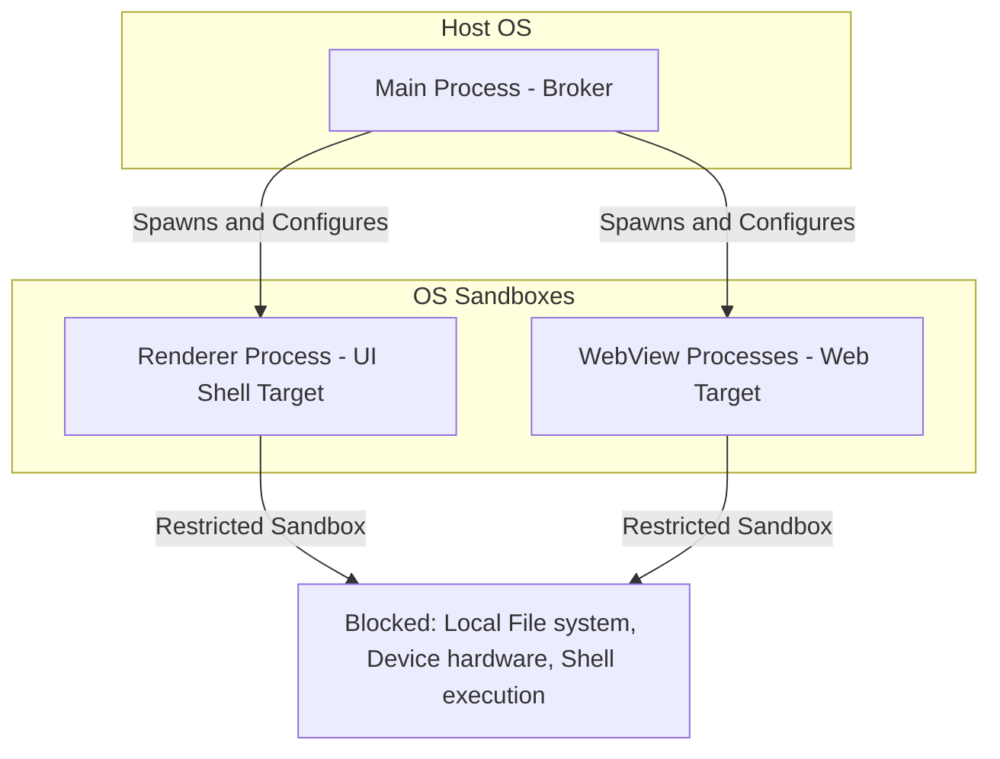
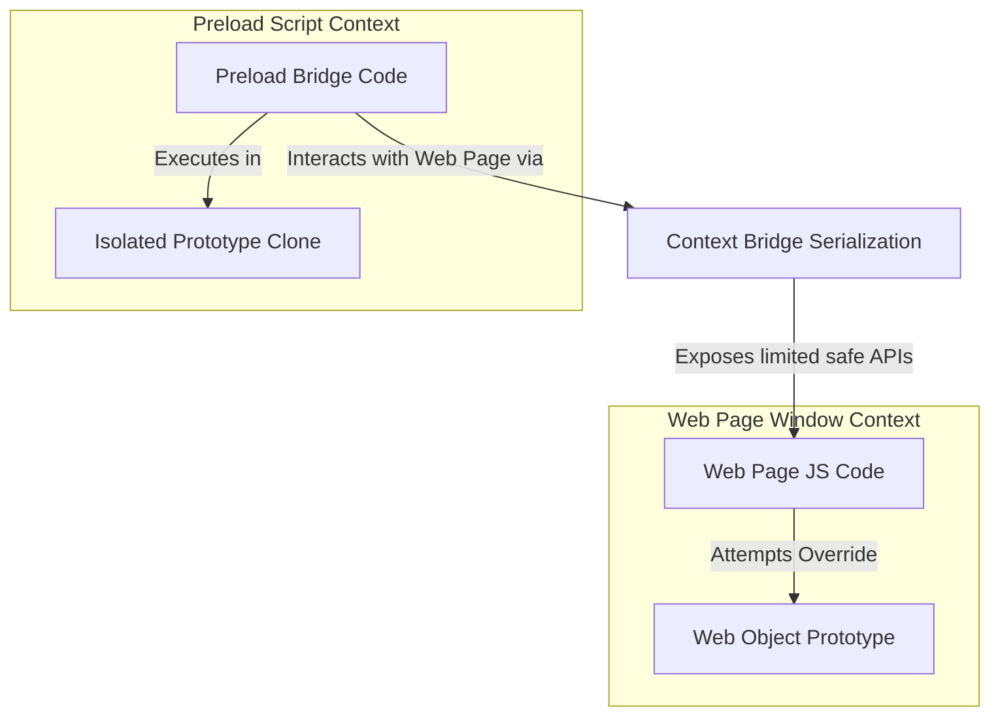

# Security Architecture - Sandboxing and CSP

## 1. Process Sandboxing and Chromium Broker Model

Project Atlas enforces strict operating system-level sandboxing on all processes that parse external inputs. The application separates processes into two security categories:

- **The Broker (Main Process)**: Runs with standard user privileges. It has access to file system directories, databases, and network adapters.
- **The Targets (Renderer & WebView Processes)**: Runs within restricted OS-level sandboxes. On Windows, they use restricted tokens; on macOS, they leverage the App Sandbox; on Linux, they utilize namespaces and chroot jails. They cannot access local files, hardware APIs, or make unauthorized system calls directly.



To guarantee these sandboxes are active, the following boot parameters are passed to Electron:

```typescript
import { app } from 'electron'

// Force sandbox at the OS level
app.enableSandbox()
```

---

## 2. Context Isolation and Prototype Pollution Defense

To prevent malicious web pages from exploiting Electron APIs by overriding standard Javascript functions (Prototype Pollution), Project Atlas mandates `contextIsolation`.



### Context Isolation Safeguards:

- The web page execution environment has no access to the Preload script's memory space or scope.
- Object references passed through the context bridge are serialized and cloned to prevent prototype pollution or callback redirection.
- Raw Node.js symbols (`require`, `process`, `Buffer`) are entirely omitted from the preload environment.

---

## 3. UI Shell Content Security Policy (CSP)

The main UI renderer displays the browser shell (React frontend). Because this UI can control settings and switch profiles, it must be protected against Cross-Site Scripting (XSS). We enforce a strict CSP on the local application shell:

```html
<meta
  http-equiv="Content-Security-Policy"
  content="
    default-src 'none';
    script-src 'self' 'unsafe-inline';
    style-src 'self' 'unsafe-inline';
    img-src 'self' data: https:;
    connect-src 'self' https://sentry.io https://easyblocklists.net;
    font-src 'self' data:;
    child-src 'none';
    object-src 'none';
  "
/>
```

- **`default-src 'none'`**: Blocks all request types by default.
- **`script-src 'self'`**: Restricts script execution to local files packed inside the application installer. `eval()` and `new Function()` are completely blocked.
- **`connect-src`**: Restricts network communication of the React shell to specified APIs (e.g., Sentry error reporting, updating blocker lists).

---

## 4. WebView Permission Management

Websites frequently request permissions to access hardware (microphones, cameras, location, notifications). By default, Electron inherits OS permissions. Project Atlas implements a strict **Zero-Trust Permission Gate** in the Main process:

```typescript
import { session } from 'electron'

export function configureSecurityPermissions(sessionInstance: Electron.Session) {
  sessionInstance.setPermissionRequestHandler((webContents, permission, callback, details) => {
    const origin = new URL(details.requestingUrl).origin

    // 1. Never allow MIDI Sysex, Clipboard Read, or Geolocation automatically
    const dangerousPermissions = ['midiSysex', 'geolocation', 'clipboard-read']
    if (dangerousPermissions.includes(permission)) {
      return callback(false) // Silent block
    }

    // 2. Intercept and prompt user for camera/microphone
    if (permission === 'media') {
      // Query settings from profile-specific SQLite database
      const profileId = getProfileIdFromSession(sessionInstance)
      const isAllowed = checkPermissionSetting(profileId, origin, 'media')
      return callback(isAllowed)
    }

    // Default block for unhandled permissions
    callback(false)
  })
}
```
