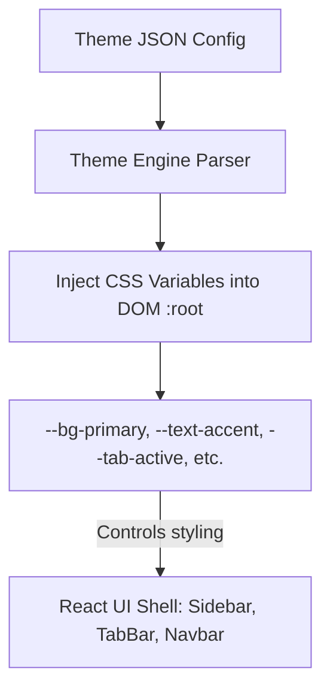

# Theme Engine Design and Custom Styling

## 1. CSS Variable Injection Architecture

Project Atlas UI (React shell) is styled using standard CSS variables (Custom Properties). This design decouples components from styles, allowing instant theme swapping without re-rendering or rebuilding the React component tree. The Theme Engine reads a JSON theme file and injects its variables directly into the `:root` element of the application document.



---

## 2. Theme Configuration Schema (JSON)

Themes are represented by a standardized JSON schema. This format allows both internal pre-defined themes (Light, Dark, AMOLED) and user-contributed themes downloaded from the community marketplace.

```json
{
  "id": "dracula-theme",
  "name": "Dracula Night",
  "author": "Community Contributor",
  "type": "dark",
  "colors": {
    "background-primary": "#282a36",
    "background-secondary": "#21222c",
    "background-active": "#44475a",
    "text-primary": "#f8f8f2",
    "text-muted": "#6272a4",
    "accent-color": "#bd93f9",
    "accent-hover": "#ff79c6",
    "border-color": "#44475a",
    "tab-active": "#282a36",
    "tab-inactive": "#1e1f29",
    "navbar-bg": "#21222c",
    "sidebar-bg": "#1e1f29"
  }
}
```

### Pre-defined Themes Core Mapping

- **Light Theme**: High-contrast, neutral color palette optimized for bright environments.
- **Dark Theme**: Standard slate gray theme minimizing eye strain.
- **AMOLED Black**: True black palette (`#000000`) designed to minimize power consumption on organic LED screens.

---

## 3. Theme Manager Implementation (React Hooks)

The application handles theme mutations through a React Context combined with the Zustand profile state store.

```typescript
import React, { createContext, useContext, useEffect, useState } from 'react';

interface ThemeColors {
  [key: string]: string;
}

interface ThemeConfig {
  id: string;
  name: string;
  colors: ThemeColors;
}

export const ThemeContext = createContext<{
  currentTheme: string;
  applyTheme: (theme: ThemeConfig) => void;
} | null>(null);

export const ThemeProvider: React.FC<{ children: React.ReactNode }> = ({ children }) => {
  const [currentTheme, setCurrentTheme] = useState('default-dark');

  const applyTheme = (theme: ThemeConfig) => {
    const root = document.documentElement;

    // Iterate over the theme color key-value pairs
    Object.entries(theme.colors).forEach(([key, value]) => {
      // Map custom keys to CSS Variable formats: background-primary -> --background-primary
      root.style.setProperty(`--${key}`, value);
    });

    setCurrentTheme(theme.id);
  };

  return (
    <ThemeContext.Provider value={{ currentTheme, applyTheme }}>
      {children}
    </ThemeContext.Provider>
  );
};
```

---

## 4. Theme Engine CSS Setup

In the main stylesheet, default values are set to handle initialization states before the Theme Engine mounts:

```css
/* src/styles/theme.css */
:root {
  /* Default fallbacks (Dracula-like baseline) */
  --background-primary: #1e1e24;
  --background-secondary: #141419;
  --text-primary: #e2e2e2;
  --accent-color: #3f88c5;
  --border-color: #2b2b35;
}

body {
  background-color: var(--background-primary);
  color: var(--text-primary);
  font-family: -apple-system, BlinkMacSystemFont, 'Segoe UI', Roboto, sans-serif;
  margin: 0;
}

.sidebar-container {
  background-color: var(--background-secondary);
  border-right: 1px solid var(--border-color);
}

.tab-active {
  background-color: var(--background-primary);
  border-bottom: 2px solid var(--accent-color);
}
```
