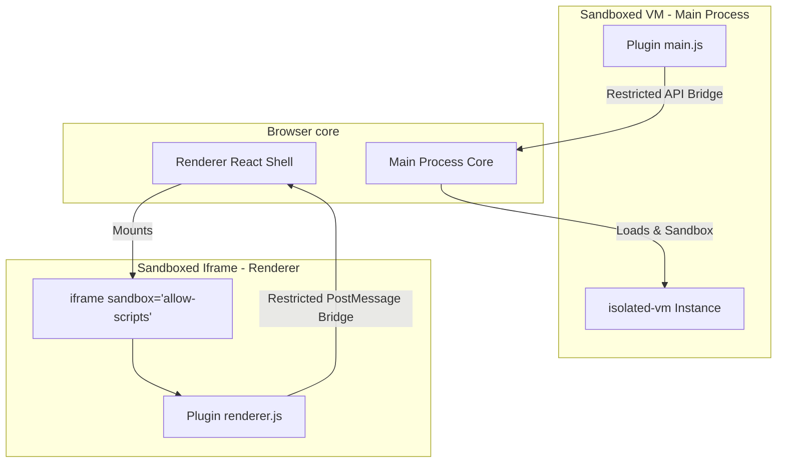
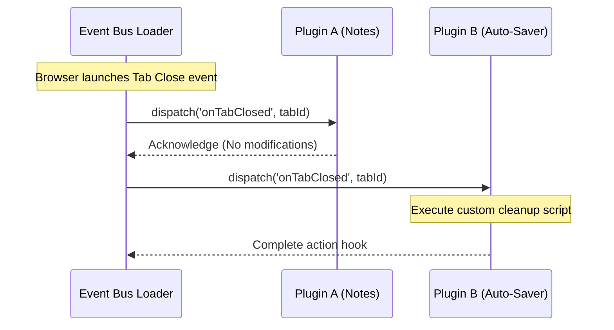

# Modular Plugin Architecture and Loader Design

## 1. Plugin vs. WebExtension Comparison

While standard WebExtensions (Chrome Extensions) manipulate webpage content, **Plugins** in Project Atlas are designed to extend the browser itself. They can add new sidebars, register keyboard shortcuts, hook into network lifecycles, and create custom database collections.

| Feature              | Chrome Extensions             | Project Atlas Plugins               |
| :------------------- | :---------------------------- | :---------------------------------- |
| **Execution Domain** | Sandboxed Web Page Context    | Sandboxed Node.js VM / Renderer UI  |
| **UI Customization** | Popups, Side panels (limited) | Full React UI widgets, Custom views |
| **Access level**     | Chrome API subset             | Native hooks, limited local storage |
| **Distribution**     | Chrome Web Store              | Custom Atlas Store (JSON packages)  |

---

## 2. Plugin Manifest and Permissions Schema

Plugins must declare their capabilities in a `manifest.json`. The Loader verifies these permissions before mounting the plugin.

```json
{
  "id": "atlas-markdown-notes",
  "name": "Markdown Notebook",
  "version": "1.0.0",
  "description": "Integrated markdown sidebar panel with note tags.",
  "permissions": ["ui:sidebar", "storage:local", "tabs:read"],
  "entry": {
    "renderer": "dist/renderer.js",
    "main": "dist/main.js"
  }
}
```

---

## 3. Sandboxed Plugin Execution Model

To prevent a malicious or buggy plugin from crashing the browser or stealing passwords, the Main Process executes plugin code inside an isolated **Node VM (using `vm2` or `isolated-vm` libraries)**. The Renderer Process mounts them inside an iframe with restricted sandboxing:



### The API Bridge implementation (Main Process)

```typescript
import { IsolatedVM } from 'isolated-vm'

export class PluginSandbox {
  private vmContext: any

  constructor(
    private pluginId: string,
    private manifest: any
  ) {}

  public async initialize(rawCode: string) {
    // 1. Create an isolated execution context with limited memory
    const isolate = new IsolatedVM({ memoryLimit: 128 }) // 128MB max
    const context = await isolate.createContext()
    const jail = context.global

    // 2. Inject restricted API bridges
    await jail.set('global', jail.derefInto())
    await jail.set('_atlas_bridge', (action: string, args: string) => {
      return this.handlePluginRequest(action, JSON.parse(args))
    })

    // 3. Compile and execute plugin script
    const script = await isolate.compileScript(rawCode)
    await script.run(context)
    this.vmContext = context
  }

  private handlePluginRequest(action: string, args: any) {
    // Enforce permission checks matching the manifest
    if (action === 'tabs:get' && this.manifest.permissions.includes('tabs:read')) {
      return getActiveTabsList()
    }
    throw new Error(`Permission Denied: Action '${action}' not listed in manifest.`)
  }
}
```

---

## 4. Runtime Hook Event Bus

Plugins register handlers that subscribe to browser event hooks. The event bus marshals and dispatches these actions sequentially.



### Available Plugin Hook Events:

- **`onBeforeRequest`**: Intercept, redirect, or inspect outbound HTTP headers.
- **`onTabCreated` / `onTabClosed`**: Listen to tab state changes to update custom widgets.
- **`onThemeRegister`**: Dynamically inject custom stylesheets or colors into the Theme Engine.
- **`onSidebarWidgetRegister`**: Mount a custom button in the sidebar that opens a sandboxed plugin panel.
