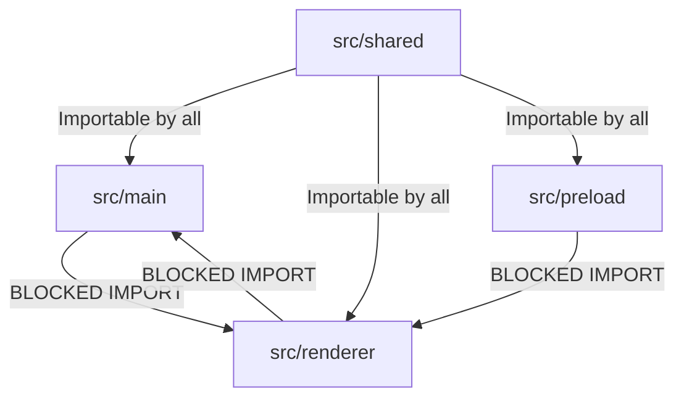

# Project Folder Structure and Module Layout

## 1. Directory Tree Overview

Project Atlas Browser is designed as a modular monorepo structure. Below is the production-ready directory layout of the codebase:

```text
/Users/lokeshchoudhary/lokesh/kitkatbrowser/
├── package.json                   # Project dependencies and workspace scripts
├── tsconfig.json                  # Root TypeScript configurations
├── electron-builder.yml           # Packaging and build settings
├── vite.config.ts                 # Vite bundler configurations for React and Preload
├── docs/                          # Architecture and contributor markdown docs
│   ├── 01_system_design.md
│   └── ...
├── src/
│   ├── main/                      # Electron Main Process (Node.js Core)
│   │   ├── index.ts               # App entry point
│   │   ├── db/                    # SQLite database connections and schemas
│   │   ├── security/              # Sandboxing, permissions, cryptographic vaults
│   │   ├── services/              # Engines: adblocker, profile, workspaces, session
│   │   └── ipc/                   # IPC listener registry
│   ├── renderer/                  # Electron Renderer Process (React Shell UI)
│   │   ├── index.html             # Shell entry document
│   │   ├── src/
│   │   │   ├── main.tsx           # React mounting code
│   │   │   ├── components/        # Reusable UI elements (Tabs, AddressBar, Notes)
│   │   │   ├── store/             # Zustand global states (profileStore, tabStore)
│   │   │   ├── styles/            # Theme variables and global styling
│   │   │   ├── hooks/             # Custom React lifecycle hooks
│   │   │   └── App.tsx            # Main shell router container
│   ├── preload/                   # Preload Scripts (Isolated bridge)
│   │   ├── index.ts               # contextBridge exposure
│   │   └── webview-preload.ts     # Script injected into <webview> pages
│   └── shared/                    # Types and Constants shared across processes
│       ├── constants.ts           # IPC Channel definitions, default urls
│       └── types.ts               # Tab, Note, Profile, Session interfaces
├── scripts/                       # Devops, certificate signing, linting scripts
│   ├── build.js
│   ├── db-migrate.js
│   └── security-scan.sh
└── tests/                         # Automated test directories
    ├── unit/                      # Unit tests (Vitest)
    ├── integration/               # IPC interface verification
    └── e2e/                       # Application flow verification (Playwright)
```

---

## 2. Process Boundaries and Import Rules

To prevent runtime import failures and maintain strict context isolation, modules must adhere to the following import rules:



- **`src/main`**: May import standard Node.js libraries, Electron APIs, sqlite3 databases, and the cryptographic module. It must **never** import React UI files, CSS stylesheets, or DOM elements.
- **`src/renderer`**: May import React components, Zustand files, CSS stylesheets, and the preload types exposed by `atlasAPI`. It must **never** import Node.js core modules (`fs`, `child_process`, `crypto`) or SQL database scripts directly.
- **`src/preload`**: Functions as the boundary. It may import specific Electron IPC APIs but must keep external dependencies minimal.
- **`src/shared`**: Restrict to TypeScript interfaces, constant lists, and utility validation scripts. It must contain no executable code that binds to either Node or browser environments exclusively.
