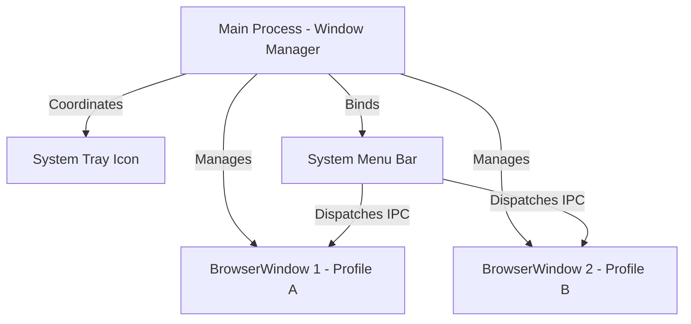
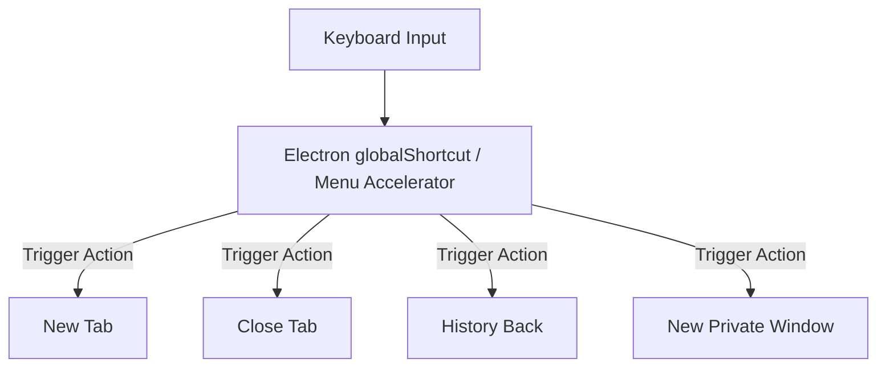

# Desktop Application Architecture - OS Integration

## 1. Native Windows and UI Shell Window Management

Project Atlas is built to run as a multi-window desktop application. The Main Process manages native windows using Electron's `BrowserWindow` instance class.



### Multi-Window Instantiation

```typescript
import { BrowserWindow, app } from 'electron'
import path from 'path'

export function createBrowserWindow(profileId: string): BrowserWindow {
  const win = new BrowserWindow({
    width: 1200,
    height: 800,
    titleBarStyle: 'hiddenInset', // Custom titlebar integration for macOS
    frame: process.platform === 'darwin' ? false : true, // Frameless on macOS, standard on Win/Linux
    webPreferences: {
      preload: path.join(__dirname, '../preload/index.js'),
      contextIsolation: true,
      nodeIntegration: false,
      sandbox: true
    }
  })

  // Load the React application shell index
  win.loadURL(
    process.env.NODE_ENV === 'development'
      ? 'http://localhost:5173'
      : `file://${path.join(__dirname, '../renderer/index.html')}`
  )

  return win
}
```

---

## 2. Titlebars and Window Controls Integration

To present a clean, modern UI (matching Arc or Vivaldi), we hide the standard OS window titlebar and draw a custom titlebar in the React renderer layer.

- **macOS (Traffic Light Controls)**: Handled natively using `titleBarStyle: 'hiddenInset'`. This hides the title bar but keeps the close, minimize, and full-screen traffic lights floated in the top-left corner. The React shell simply leaves empty space (padding) to prevent layout overlap.
- **Windows & Linux (Frame Controls)**: The default window frame is hidden, and window controls (minimize, maximize, close buttons) are custom-rendered in the React header. These custom buttons trigger window states using the context bridge:
  ```typescript
  // Triggered on click of custom Windows close button
  atlasAPI.send('toMain:window-close')
  ```

---

## 3. Keyboard Accelerator Registry

A high-performance browser relies on instant response to keyboard shortcuts. Shortcuts are registered at the application level.



### Core Shortcuts Mapping Table

| Action                  | Accelerator Key (macOS) | Accelerator Key (Win/Linux) | Channel triggered            |
| :---------------------- | :---------------------- | :-------------------------- | :--------------------------- |
| **New Tab**             | `Cmd+T`                 | `Ctrl+T`                    | `shortcut-new-tab`           |
| **Close Tab**           | `Cmd+W`                 | `Ctrl+W`                    | `shortcut-close-tab`          |
| **Focus Address Bar**   | `Cmd+L`                 | `Ctrl+L`                    | `shortcut-focus-address`     |
| **Reload Active Tab**   | `Cmd+R`                 | `Ctrl+R`                    | `shortcut-reload-tab`        |
| **Force Reload Active** | `Cmd+Shift+R`           | `Ctrl+Shift+R`              | `shortcut-forcereload-tab`   |
| **Lock Active Profile** | `Cmd+Shift+P`           | `Ctrl+Shift+P`              | `shortcut-lock-profile`      |
| **Toggle Sidebar Panel**| `Cmd+B`                 | `Ctrl+B`                    | `shortcut-toggle-sidebar`    |

---

## 4. Protocol Registration and Deep Linking

To operate as the default system browser, Project Atlas registers protocol handlers with the operating system on install.

- **Handlers**: Registered for `http://` and `https://` schemas.
- **Deep Linking**: When an external link is clicked, the OS launches Project Atlas, passing the URL argument to the main application process.
- **Startup Event Capture**:
  ```typescript
  // Catch link opened when app is already running
  app.on('open-url', (event, url) => {
    event.preventDefault()
    // Route link destination to the active browser window's webview
    sendURLToActiveWindow(url)
  })
  ```
