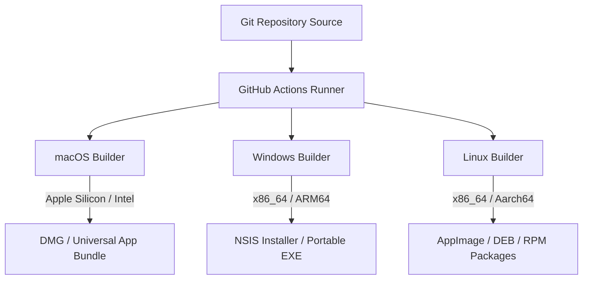

# Cross-Platform Build and Code-Signing Strategy

## 1. Multi-Platform Build Matrices

Project Atlas is compiled for macOS, Windows, and Linux. Because the codebase uses native node dependencies (`better-sqlite3`, `@atlas/adblock-core`, and cryptographic packages), binaries must be compiled separately for each CPU architecture:



---

## 2. Electron Builder Configuration

The compile operations are handled by `electron-builder`. Below is the configuration file `electron-builder.yml`:

```yaml
appId: net.atlasbrowser.app
productName: AtlasBrowser
directories:
  output: dist
  buildResources: build
files:
  - dist/main/**/*
  - dist/renderer/**/*
  - dist/preload/**/*
  - package.json
asar: true # Package files into encrypted archive to prevent file modifications
mac:
  category: public.app-category.productivity
  target:
    - target: dmg
      arch:
        - x64
        - arm64
  hardenedRuntime: true # Required for macOS Notarization
  gatekeeperAssess: false
  entitlements: build/entitlements.mac.plist
  entitlementsInherit: build/entitlements.mac.inherit.plist
win:
  target:
    - target: nsis
      arch:
        - x64
        - arm64
  publisherName: 'Atlas Browser Open Source Project'
nsis:
  oneClick: false
  allowToChangeInstallationDirectory: true
linux:
  target:
    - AppImage
    - deb
    - rpm
  category: WebBrowser
```

---

## 3. Code-Signing and Notarization Protocols

Unsigned desktop software triggers prominent warnings on Windows (SmartScreen) and macOS (Gatekeeper blocks), damaging user trust. Code signing is integrated into the release workflows.

### macOS (Notarization Protocol)

- **Certificates**: Require an **Apple Developer ID Application Certificate**.
- **Hardened Runtime**: Enabled during signing to prevent DLL injection attacks.
- **Apple Notarization**: After signing, the `.app` bundle is compressed and uploaded to Apple's notarization servers via the command-line utility `notarytool`:
  ```bash
  xcrun notarytool submit dist/AtlasBrowser-mac.dmg --keychain-profile "Developer-Atlas" --wait
  ```
- **Stapling**: The notarization receipt is stapled to the DMG, allowing Gatekeeper to verify the app's integrity offline.

### Windows (Authenticode Certificate)

- **Certificates**: Signed using a **Microsoft Authenticode Certificate** (an EV - Extended Validation certificate is preferred to instantly bypass SmartScreen warnings).
- **Signing Command**: Integrated into CI using `signtool.exe` or an equivalent remote cloud HSM (Hardware Security Module) signing runner.

---

## 4. Native Dependency Rebuild Strategy

Native dependencies compile C/C++ or Rust code into `.node` binaries. They are built for the user's host machine architecture during installation. During release compilation, we must force a target-platform cross-rebuild:

```bash
# Force cross-compilation of native dependencies
npx electron-rebuild --arch arm64 --platform darwin
npx electron-rebuild --arch x64 --platform win32
```

This ensures SQLCipher (`better-sqlite3` native package) and the Rust blocker match the target environment's architecture.
