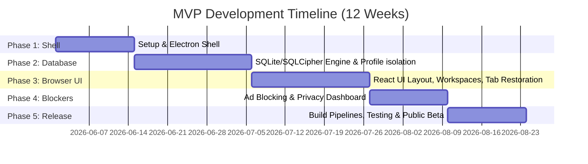

# MVP Roadmap and Delivery Plan

## 1. MVP Scope and Feature Matrix

The Minimum Viable Product (MVP) for Project Atlas Browser focuses on laying down the secure multi-profile structure, the modular tab workspace layout, and a lightweight ad blocker. Secondary features (like the plugin marketplace, hardware biometrics, and multi-profile cloud sync) are deferred to subsequent releases.

| Feature Area      | MVP Scope (v0.1.0)                                                                | Production Release (v1.0.0)                                        |
| :---------------- | :-------------------------------------------------------------------------------- | :----------------------------------------------------------------- |
| **Multi-Profile** | Local profiles, database-level isolation, standard password protection.           | Biometric integration (Touch ID/Windows Hello), profile sync.      |
| **Workspaces**    | 3 workspaces maximum, basic tab switching, state saving to local SQLite.          | Unlimited workspaces, custom workspace icons, tab groupings.       |
| **Ad Blocker**    | Local EasyList integration, standard WebRequest interception (TS-based matching). | Rust Compiled Trie-engine, EasyPrivacy, dynamic user rule editors. |
| **Theme Engine**  | Light, Dark, AMOLED Black. Custom color overrides via settings config.            | Complete JSON theme importing, community theme marketplace.        |
| **Notes Engine**  | Single folder notes, raw markdown rendering.                                      | Nested folders, full text search, notes synchronization.           |
| **Plugins**       | Not supported.                                                                    | Sandboxed iframe loader, API hook bridges.                         |

---

## 2. 12-Week Development Timeline

We divide the MVP engineering schedule into five logical phases:

---

## 3. Detailed Milestone Breakdowns

### Weeks 1 - 2: Core Core & Sandboxing

- Establish monorepo structure, typescript compiler mappings.
- Implement sandboxed `BrowserWindow` templates, preload scripts, and basic context isolation bridges.
- Construct the main process window manager and basic shell layout in React.

### Weeks 3 - 5: DB Infrastructure & Profile Isolation

- Implement the master database and profiles switcher interface.
- Configure `better-sqlite3` and set up database isolation per profile folder.
- Integrate PBKDF2/Argon2id password derivation pipelines to mount encrypted profile databases.

### Weeks 6 - 8: Workspace Controls & Lazy Tab Restorer

- Build workspaces store in Zustand.
- Develop custom tabs layout controller (switching between top tabs and vertical tabs).
- Implement tab state serialization and lazy webview mounting logic to prevent memory leakage.

### Weeks 9 - 10: Built-in Blocker & Notes Engine

- Set up the Electron `webRequest` filter hook. Load static EasyList rules and compile search indexes.
- Develop the cosmetic element hiding CSS injector.
- Add markdown note parser and SQLite notepad persistence.

### Weeks 11 - 12: Hardening, Builds & Beta

- Enforce security configurations (CSP, disable unused Electron privileges).
- Construct CI build pipelines using `electron-builder`.
- Deploy the v0.1.0 release to alpha testers and monitor stability via Sentry.
