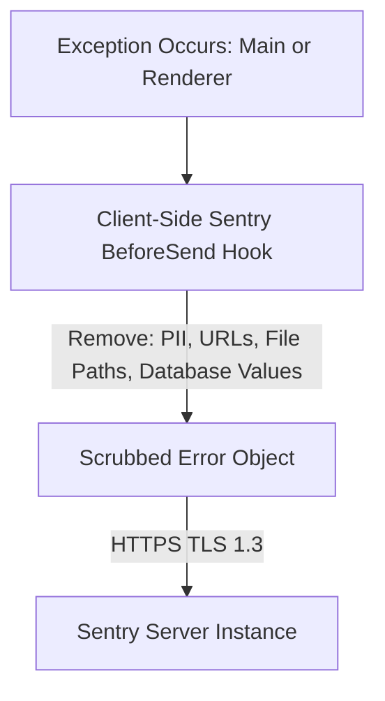
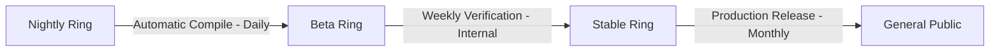

# Production Roadmap - Scalability, Diagnostics, and Release Operations

## 1. Privacy-Preserving Telemetry & Diagnostics

Standard web browsers collect detailed records of user actions, which contradicts Project Atlas's privacy model. To optimize application behavior without violating privacy:

- **Anonymous Pulse System**: We collect only aggregated, non-identifiable usage statistics (e.g., active user count, crash counts, operating system version). We completely avoid collecting page URLs, search terms, username directories, or extension lists.
- **Self-Hosted Metrics**: Data is routed to a self-hosted instance of **Plausible Analytics** or an equivalent server that strips IP addresses and avoids cookies.
- **Opt-Out Control**: Telemetry is strictly opt-in during startup configuration and can be deactivated globally in settings.

---

## 2. Secure Error Tracking (Sentry Integration)

To monitor application stability without leaking user credentials, we integrate Sentry across both the Main and Renderer processes with strict client-side data scrubbing.



### Sentry Scrubbing Script

```typescript
import * as Sentry from '@sentry/electron'

export function initializeSentry() {
  Sentry.init({
    dsn: 'https://examplePublicKey@sentry.io/exampleId',
    beforeSend(event) {
      // 1. Scrub absolute local file directories to hide OS usernames
      if (event.exception && event.exception.values) {
        event.exception.values.forEach((value) => {
          if (value.stacktrace && value.stacktrace.frames) {
            value.stacktrace.frames.forEach((frame) => {
              if (frame.filename) {
                frame.filename = frame.filename.replace(/\/Users\/[^\/]+/g, '/Users/USER_REDACTED')
              }
            })
          }
        })
      }

      // 2. Remove URL query parameters that might contain tokens
      if (event.request && event.request.url) {
        const parsedUrl = new URL(event.request.url)
        parsedUrl.search = '' // Delete query string
        event.request.url = parsedUrl.toString()
      }

      return event
    }
  })
}
```

---

## 3. Database Migration Strategy

As the browser evolves, the database schema will require modifications. Project Atlas avoids destructive updates by running a database migration manager at startup before mounting the active profile.

- **Schema Version Tracking**: The database maintains a `schema_version` user version configuration (`PRAGMA user_version`).
- **Migration Runners**: Incremental migration SQL scripts are packed in the application source.

### SQLite Migration Coordinator

```typescript
import Database from 'better-sqlite3'

export function runMigrations(dbPath: string, encryptionKey?: string) {
  const db = new Database(dbPath)
  if (encryptionKey) {
    db.pragma(`key = "x'${encryptionKey}'"`)
  }

  const currentVersion = db.pragma('user_version', { simple: true }) as number
  const migrations: { [version: number]: string } = {
    1: 'ALTER TABLE history ADD COLUMN metadata TEXT;',
    2: 'CREATE TABLE IF NOT EXISTS download_categories (id TEXT PRIMARY KEY, label TEXT);'
  }

  const targetVersion = Object.keys(migrations).length
  if (currentVersion < targetVersion) {
    db.transaction(() => {
      for (let i = currentVersion + 1; i <= targetVersion; i++) {
        db.exec(migrations[i])
      }
      db.pragma(`user_version = ${targetVersion}`)
    })()
  }
}
```

---

## 4. Release Channel Architecture

To maintain a high standard of quality, updates are distributed through three distinct release rings:



- **Nightly**: Automatically built on every commit to the main branch. Intended for developers.
- **Beta**: Compiled weekly after code-review approvals. Used to test feature additions.
- **Stable**: Production-grade releases. Inspected, signed, and notarized for general public consumption. Updates are pushed automatically via the `electron-updater` package from GitHub releases.
