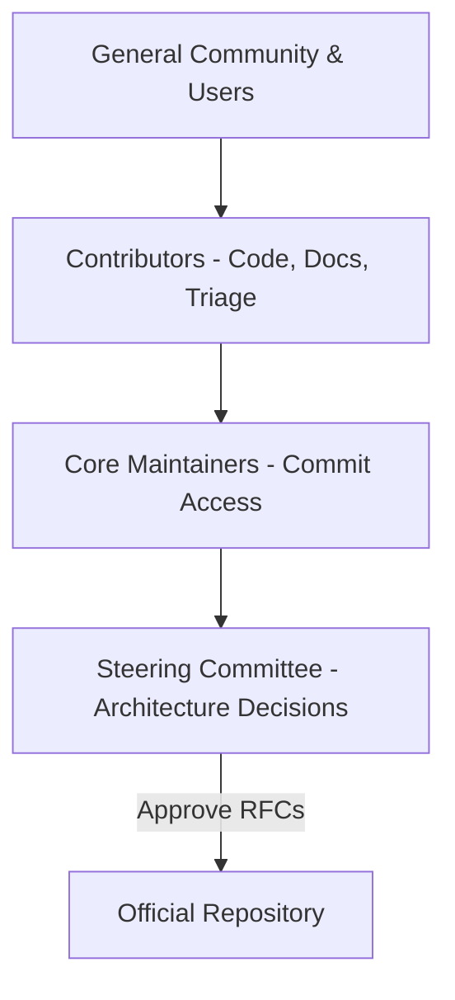
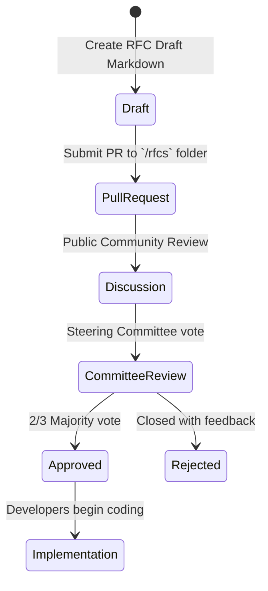

# Open Source Roadmap, Licensing, and Governance

## 1. Licensing Rationale (MIT License)

Project Atlas Browser is released under the **MIT License**. This choice aligns with our core principles of complete transparency and community-first growth:

- **Commercial Freedom**: Developers can fork, adapt, and build commercial solutions or enterprise browsers based on Project Atlas without copyleft restrictions.
- **Low Entry Barrier**: Reusing components (like our Rust ad blocker or theme engine) in other open-source projects is fully permitted, increasing the project's impact.
- **Liability Limits**: Protects contributors from legal liability, stating the software is provided "as is".

---

## 2. Governance Framework

To prevent project fragmentation and ensure coordinated engineering, Project Atlas operates under a structured, community-led governance model:

### Roles and Responsibilities:

1. **Steering Committee**: A panel of core architects who vote on major design proposals (RFCs), manage security disclosures, and determine release roadmaps.
2. **Core Maintainers**: Experienced contributors with direct commit access. They triage issues, review pull requests, and maintain build systems.
3. **Contributors**: Anyone who submits code, edits documentation, reports bugs, or translates UI strings.

---

## 3. RFC (Request for Comments) Protocol

Any major modification to the browser architecture (e.g., changing state stores, adding protocol handlers, modifying core databases) must follow the RFC process:

---

## 4. Security Disclosure and Vulnerability Handling

Security bugs (such as sandbox escapes or database key leakages) should never be disclosed via public Github issues. Project Atlas maintains a strict private patching protocol:

- **Contact Channel**: Security bugs must be reported directly to `security@atlasbrowser.net` (PGP encrypted).
- **Grace Period**: The project requests a standard 90-day grace period to inspect, reproduce, patch, and release updates before public disclosure.
- **Advisory Publication**: Patched issues are published as Github Security Advisories once the stable release containing the fix has been distributed to 80% of active users.
