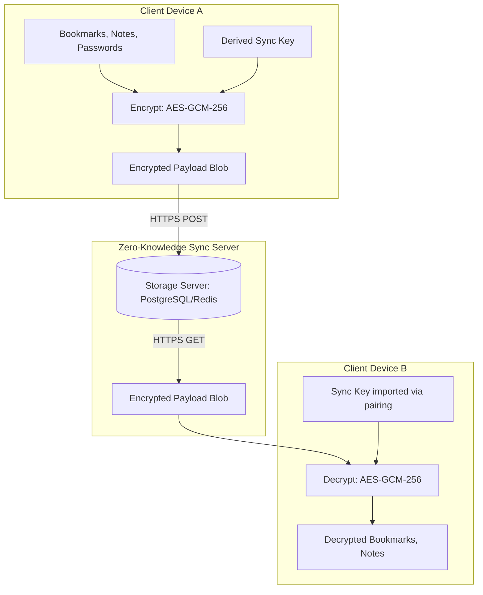
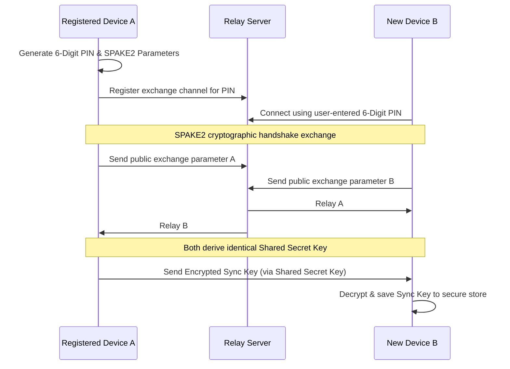

# Scaling Strategy - End-to-End Encrypted Sync Infrastructure

## 1. Zero-Knowledge E2EE Architecture

Project Atlas Sync uses an End-to-End Encrypted (E2EE) architecture. The sync server stores only encrypted payloads and cannot read bookmarks, history records, notes, or passwords. Decryption keys are generated on-device and never shared with the server.

### Key Derivation for Sync

The Sync Key is derived from a local **Secret Passphrase (12 words)** and the profile identifier using PBKDF2 with 100,000 iterations of SHA-256.

---

## 2. Sync Server APIs (REST and WebSockets)

The sync server coordinates data replication and real-time update notifications across connected devices.

| Endpoint                | Method | Payload                                            | Rationale                                                  |
| :---------------------- | :----- | :------------------------------------------------- | :--------------------------------------------------------- |
| `/api/v1/sync/register` | `POST` | `{ device_name, public_key_hash }`                 | Registers a new device to the user's encrypted pool.       |
| `/api/v1/sync/payloads` | `GET`  | Headers: `If-Modified-Since`                       | Downloads new encrypted change blobs since the last sync.  |
| `/api/v1/sync/payloads` | `POST` | `{ client_version, changes: [{ id, data_blob }] }` | Uploads new encrypted changes to the server database.      |
| `/ws/v1/sync`           | `WS`   | WebSocket Connection                               | Triggers real-time alerts when other devices push updates. |

---

## 3. Conflict Resolution via CRDTs

When multiple devices modify bookmarks or notes concurrently while offline, the browser uses **Conflict-free Replicated Data Types (CRDTs)** to merge changes automatically without data loss.

- **Bookmarks/Notes (LWW-Element-Set)**: Last-Write-Wins element set based on high-resolution UTC timestamps. If Device A updates note title at 12:00:01 and Device B updates it at 12:00:02, Device B's changes are applied.
- **TOC (Tree Structure)**: Bookmarks utilize custom fractional indexing (similar to Figma's positioning model) to maintain sorted positions in parent directories without colliding when items are moved concurrently.

---

## 4. Secure Device Pairing Handshake (SPAKE2)

To link a new device to an existing sync pool securely, we implement a **SPAKE2** key exchange handshake. This allows pairing via a short, human-readable 6-digit PIN code.

This handshake guarantees that even if a malicious actor intercepts the network traffic, they cannot impersonate a device or compromise the Sync Key without guessing the 6-digit PIN code during the brief pairing window.
