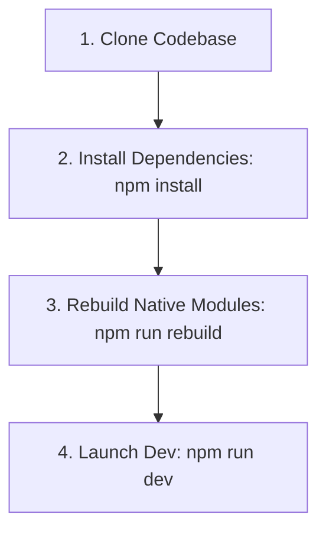

# Technical Documentation - Local Setup and Build Guide

## 1. Local Prerequisites

Project Atlas contains native Node.js addons written in C++ and Rust. Your development environment must have compile tools configured.

### macOS Setup

- Install **Xcode Command Line Tools**:
  ```bash
  xcode-select --install
  ```
- Install **Node.js** (v20.x LTS or higher) and **npm** (v10.x or higher).

### Windows Setup

- Install **Visual Studio Build Tools** (Select "Desktop development with C++" workload during installation).
- Install **Node.js** (v20.x LTS or higher).

### Linux (Ubuntu/Debian) Setup

- Install essential compiler packages:
  ```bash
  sudo apt-get update
  sudo apt-get install build-essential python3 libsecret-1-dev libdbus-1-dev
  ```

---

## 2. Setting Up the Workspace

Follow these steps to clone, configure, and boot the application in a local development environment:



### Installation CLI Operations:

```bash
# 1. Clone the project
git clone https://github.com/atlas-browser/atlas-browser.git
cd atlas-browser

# 2. Install all monorepo dependencies
npm install

# 3. Compile native libraries (SQLCipher & Rust blocker modules)
npm run rebuild

# 4. Boot the React development server and launch Electron
npm run dev
```

---

## 3. Packaging and Distributing the Application

To build executable packages for release, run the package script corresponding to your operating system:

```bash
# Compiles React code, preload files, and creates native outputs
npm run build         # Generic build execution

# Platform-specific packaging
npm run build:mac     # Output: dist/AtlasBrowser-mac.dmg
npm run build:win     # Output: dist/AtlasBrowser-win.exe
npm run build:linux   # Output: dist/AtlasBrowser.AppImage
```

---

## 4. Troubleshooting Common Build Pitfalls

### Error: `node-gyp rebuild failed`

- **Root Cause**: Python or your C++ compiler toolchain is missing from the environment PATH variables.
- **Solution**: Ensure Xcode Tools (macOS) or Visual Studio Build Tools (Windows) are installed. Set Python environment variables:
  ```bash
  npm config set python /usr/bin/python3
  ```

### Error: `better-sqlite3: Database key cannot be applied (SQLCipher missing)`

- **Root Cause**: `better-sqlite3` was compiled against standard SQLite instead of SQLCipher.
- **Solution**: Clean the build folder and force rebuild SQLCipher dependencies:
  ```bash
  npm run clean
  npm config set better-sqlite3:sqlite3 /usr/local
  npm install better-sqlite3 --build-from-source
  npm run rebuild
  ```

### Error: `Preload script path not found`

- **Root Cause**: Electron started before Vite finished packaging preload scripts in `dist/preload/index.js`.
- **Solution**: Restart the dev runner (`npm run dev`) to synchronize Vite's build lifecycle with Electron.
