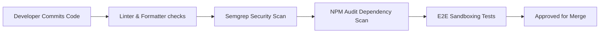

# Security Review and Hardening Checklist

## 1. Electron Framework Hardening Checklist

To prevent sandbox escapes and remote code execution vulnerabilities, every pull request containing main process or preload changes must pass these audits:

- [ ] **Context Isolation**: Enforce `contextIsolation: true` in all window configurations.
- [ ] **Node Integration**: Confirm `nodeIntegration: false` is set for all renderers and WebViews.
- [ ] **OS Sandboxing**: Confirm `app.enableSandbox()` is executed on startup and `sandbox: true` is set.
- [ ] **Navigation Verification**: Block arbitrary link navigations inside windows. Use `webContents.on('will-navigate', ...)` to only allow approved domains or cancel navigations.
- [ ] **New Window Interception**: Intercept window opening events (`setWindowOpenHandler`) to prevent arbitrary window creation.
- [ ] **Permissions Control**: Enforce explicit validation in `setPermissionRequestHandler`. Default to reject all hardware access requests.

---

## 2. Code Hardening Checkpoints

### SQL Injection Prevention

- **Standard Rule**: Never construct raw SQL strings using string concatenation or template literals.
- **Bad Practice**:
  ```typescript
  db.exec(`SELECT * FROM history WHERE url = '${userInput}'`)
  ```
- **Secure Pattern**: Use strictly parameterized queries:
  ```typescript
  const stmt = db.prepare('SELECT * FROM history WHERE url = ?')
  const results = stmt.all(userInput)
  ```

### Cryptographic Audits

- [ ] **CSPRNG Utilization**: Enforce the use of `crypto.randomBytes()` for cryptographic tokens and salts. Do not use `Math.random()`.
- [ ] **Argon2id Enforcement**: Verify KDF iterations ($N \ge 3$) and memory allocation ($M \ge 64\text{MB}$) are set.
- [ ] **AES GCM/CBC Parameters**: Verify initialization vectors (IVs) are generated uniquely per encryption operation (12 bytes for GCM, 16 bytes for CBC) and are never reused.

---

## 3. Automated Vulnerability Scans



### Integrated Devops Check CLI Tools

1. **Dependency Analysis (`npm audit`)**: Checks packages against the GitHub Advisory Database:
   ```bash
   npm audit --audit-level=high
   ```
2. **Static Application Security Testing (SAST)**: Using **Semgrep** rules tailored for Electron configurations to check for dangerous flags:
   ```bash
   semgrep scan --config auto
   ```
3. **Secret Scanning**: Prevent commits from containing private certificates or SSH keys:
   ```bash
   gitleaks detect --source=. --verbose
   ```
