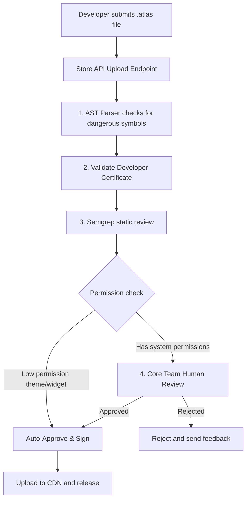

# Browser Store Architecture - Extensions, Themes, and Distribution

## 1. Store Registry and Package Structure

The Project Atlas Store provides a centralized registry for downloading verified Themes and Plugins. Content is distributed as a packaged file (`.atlas`) which is a compressed zip file containing the source files, assets, and a cryptographic signature.

```text
package-name.atlas (ZIP Archive)
├── manifest.json                  # Extension permissions and configurations
├── signature.sig                  # Developer cryptographic signature
├── icon.png                       # Marketplace icon asset
├── dist/
│   ├── main.js                    # Compiled main process hook bundle (optional)
│   └── renderer.js                # Compiled React UI dashboard bundle
└── LICENSE                        # Open source license (MIT required)
```

---

## 2. Package Submission and Verification Pipeline

To prevent malware or malicious tracker extensions from entering the official marketplace, all submissions undergo a strict verification pipeline:



### Static Analysis Checks (AST Verification)

The store submission runner executes an AST (Abstract Syntax Tree) analyzer that scans javascript files for prohibited symbols and Node APIs:

- **Prohibited Calls**: `child_process.exec`, `fs.rm`, `require('child_process')`, raw socket binds.
- **Permitted API Access**: Curated browser helper calls like `atlas.tabs`, `atlas.storage`, or custom REST integrations.

---

## 3. Cryptographic Package Signing

To prevent middleman tampering, packages are signed by both the author and the official Atlas App Store:

1. **Developer Signature**: The developer signs the compiled payload hash using their private PGP/ECDSA key.
2. **Registry Verification**: The Registry server verifies the developer signature against their registered public developer key.
3. **Registry Co-signing**: Once the security review succeeds, the registry signs the package with the **Official Atlas Store Private Key**.
4. **Client-side Verification**: When the browser downloads the package, the local plugin manager verifies the Registry's signature. If it doesn't match the hardcoded public store key, the browser blocks installation.

---

## 4. CDN Distribution and Registry APIs

Packages are stored and distributed via a geographically replication CDN (e.g., Cloudflare R2 / AWS S3).

| Endpoint                      | Method | Response                      | Description                                      |
| :---------------------------- | :----- | :---------------------------- | :----------------------------------------------- |
| `/api/store/v1/search`        | `GET`  | JSON list of listings         | Search and filter packages by category.          |
| `/api/store/v1/package/{id}`  | `GET`  | Manifest metadata             | Fetch detail cards, developer info, and ratings. |
| `/api/store/v1/download/{id}` | `GET`  | Binary stream (`.atlas` file) | Downloads the signed archive payload.            |
